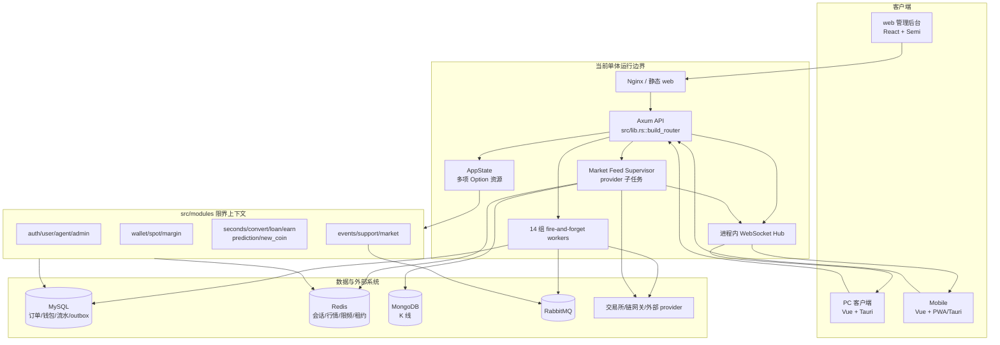
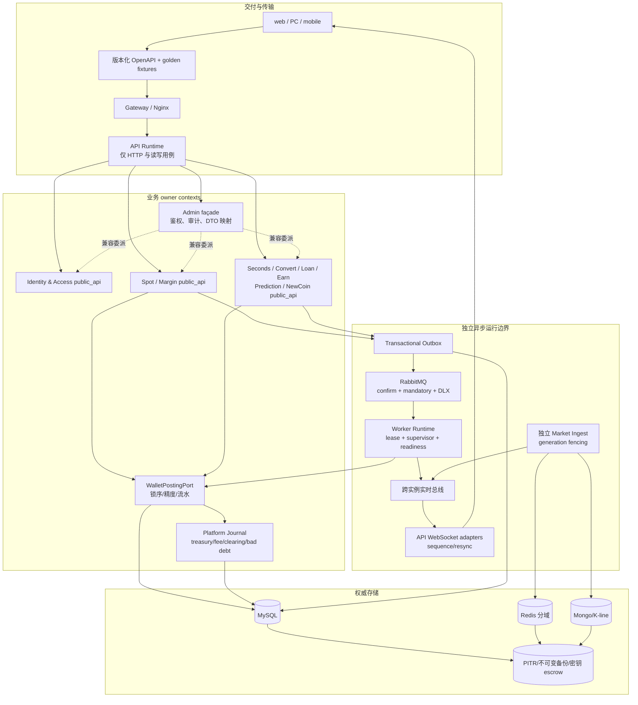
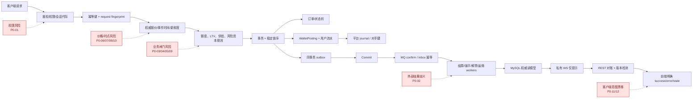
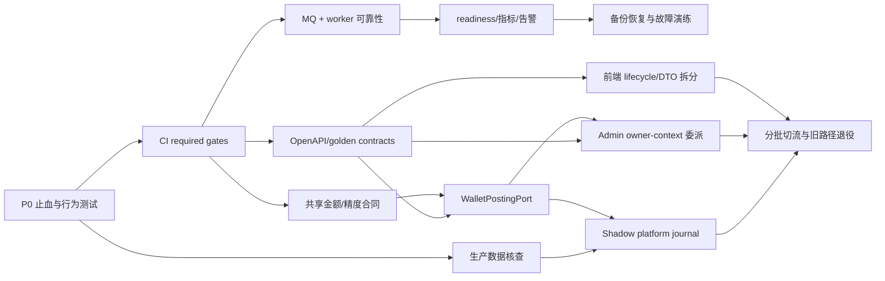

# 项目结构与业务流程优化审计（2026-08-24）

> 状态：静态审计收口版
> 审计对象：Rust 后端、`web/` 管理后台、`pc/`、`mobile/`、MySQL migrations、RabbitMQ/outbox/inbox、workers、行情/WebSocket、Docker/1Panel、CI、可观测性、备份恢复与 Trellis 任务治理
> 证据基线：2026-08-24 当前工作树；行号随后续编辑可能偏移，故同时保留符号名
> 优先级：P0 仅用于可直接造成资金、权限、结算/价格时点或不可恢复数据正确性风险的路径；P1 用于明显影响可用性、维护性或交付可靠性的缺口；P2 用于一致性、体验、性能与治理改进

## 1. 执行摘要

本仓库不是“没有架构和测试”的项目。Rust 后端已有可选 DDD 分层、事务与行锁、幂等键、钱包流水、独立 migrator、架构守卫；管理后台已有 Vitest/Testing Library；mobile 已建立公共行情静默检测、私有事件只作提示并通过 REST 对账的正确边界。审计重点不是推翻这些基础，而是补齐跨时间、跨存储、跨进程和跨端契约的最后一公里。

五份研究中的重复结论已按同一根因合并，不把同一问题在后端、业务流和运维研究中的重复出现累计多次。最终形成 **12 项 P0、21 项 P1、8 组 P2**：

- **P0 集中在四类直接风险**：默认通配管理员；提现外部广播歧义；新币/借贷/杠杆等资金闸门；秒合约/预测/闪兑/行情代际的价格与时点；PC/mobile 对真实资金操作的契约漂移。
- **P1 集中在四类系统性缺口**：MQ 与 worker 可靠性；平台总账、金额精度和状态约束；三端契约与行为测试；交付、可观测性、备份恢复和任务治理。
- **实施顺序必须固定**：先守住权限、资金、价格时点和客户端操作意图；再补异步可靠性、CI/迁移/恢复门禁；最后通过兼容 façade 分批收拢钱包、admin 和前端边界。
- **不建议一次性重写**：所有结构调整都应保留现有 HTTP、JSON、SQL、事件和前端调用 façade，以 characterization tests、shadow compare、expand-contract migration 和按能力切流完成迁移。

### 1.1 去重与严重级别校准

| 重复研究结论 | 本报告归并 | 校准理由 |
| --- | --- | --- |
| 默认管理员在 backend/data-ops 重复 | P0-01 | 同一 `bootstrap_default_admin_while_locked` 根因，只计一次 |
| 提现歧义失败在 business/data-ops 重复 | P0-02 | 同一 `run_once_with_gateway` 终态错误，只计一次 |
| 注册钱包、publisher confirm、队列未配置在三份研究重复 | P1-01 | 同一 `user.created` 交付链；可幂等补齐且不是直接动账攻击路径，未机械沿用研究中的 P0 |
| CI 缺口在 inventory/backend/frontend/data-ops 重复 | P1-14 | 合并为一条交付门禁问题 |
| 进程内 WS、跨实例 fan-out、客户端对账重复 | P1-10 | 以“权威 REST + 可丢提示”的统一合同收口 |
| PC 风险展示、加载失败和网络回退曾被研究标为 P0 | P1-07/P1-16 | 影响决策或造成可恢复冻结，但没有证据证明其本身必然直接动账，降为 P1 |
| 行情旧 provider 子任务泄漏 | P0-10 | 保留 P0：旧代际可继续写入资金路径使用的价格事实，直接影响成交/结算/强平 |
| 充值费、返佣反冲、杠杆计息 | P1-05/P1-08/P1-07 | 有直接财务影响，但暴露依赖生产配置、worker 开关或历史数据，先列 P1 并要求生产核查；证据成立后可升级 |

## 2. 审计范围、方法与限制

### 2.1 范围与方法

1. 以 tracked files、任务 PRD、五份专题 research 和注入 spec 为事实基线，不把 `target`、`node_modules`、构建产物或本机索引计入生产结构。
2. 按“请求 → 鉴权/权限 → 应用服务 → 领域规则 → 订单/钱包/流水 → outbox/MQ → worker → 读模型/私有 WS → 前端状态”追踪资金和状态。
3. 交叉核对源码、migration、测试、部署样例和 CI；严重级别以可发生的结果而不是研究文件中的原标签决定。
4. 对同一根因只给一个规范 ID；详细逐文件证据保留在附录 research 中。
5. 已有基线验证显示 Rust fmt/clippy、架构测试、web 测试、PC/mobile type-check/mobile tests 可通过；这证明仓库已有质量能力，也证明 CI 没有调用它们是流程缺口。

### 2.2 明确限制

- 本报告是**静态审计**，不能替代生产 MySQL/Mongo/Redis/RabbitMQ 数据核对、链上交易核对、真实多副本拓扑观察、容量压测、故障注入或恢复演练。
- 未读取生产 Secret、云 WAF/KMS、RabbitMQ policy、1Panel 外部健康检查、GitHub branch/environment protection、云备份/PITR 或告警平台。此类仓库外能力一律标记为 **待补证**，而不是断言不存在。
- 未证明线上已经出现超发、双付、坏账或错结算；P0 表示源码存在可直接到达该结果的路径。生产核查结果决定实际暴露量和修复数据范围。
- 行号对应 2026-08-24 当前工作树；后续复核应优先用同时给出的函数、组件或 migration 名定位。
- 现货究竟是中央订单簿还是系统做市柜台属于产品定义，仓库内尚未形成唯一合同；相关项因此列 P1 而非直接判定撮合缺陷。

## 3. 现状优点

1. **后端已有真实架构防线**：`tests/backend_architecture.rs:12-199` 执行可选 DDD 层、依赖方向、测试位置和文件上限，不应以新增空层替代职责拆分。
2. **核心资金路径普遍有事务基础**：现货、杠杆、秒合约、充提、客服等大量路径使用 MySQL 事务、`FOR UPDATE`、状态条件和幂等键；主要风险位于跨 HTTP/DB、Redis/DB、时间和进程边界。
3. **钱包流水和余额快照已广泛存在**：多数用户余额变更会写 `wallet_ledger` 和 after snapshot，为后续引入平台 journal 与对账提供迁移基础。
4. **迁移启动顺序正确**：`exchange-migrate` 独立于 API；完整 Compose 使用 MySQL healthy → migrator completed → API 的顺序，API 不在运行期隐式迁移。
5. **outbox/inbox 已有至少一次骨架**：业务事务与 outbox 原子提交，inbox 有唯一键、租约、ACK-after-state 和重试；缺口是 publisher confirm、拓扑、启用和运维闭环。
6. **mobile 实时恢复边界较成熟**：公共行情有 heartbeat/watchdog/backoff/租约；私有强平事件只触发 REST 对账，不把可丢事件金额当资金事实。
7. **客服流程是良好样板**：消息不可变、同正文幂等、异正文冲突、精确代理隔离、游标和改派均以 MySQL/REST 为权威。
8. **前端并非无测试**：web 有 52 个测试文件/381 条基线测试；mobile 有 482 条基线测试；下一步是补行为层和将已有命令纳入 CI，而不是抛弃现有合同测试。
9. **镜像基础有正向控制**：runtime 非 root、使用 tini/supervisor、Rust `--locked`、npm `ci`，workflow 生成 SHA tag 并核验多架构 manifest digest。

## 4. 当前项目结构图

当前关键耦合是：API 与全部 workers 同进程/同副本启动；`AppState` 作为全局可选 service locator；admin 平行实现多个业务域；11 个非钱包上下文直接写钱包表；WebSocket 和行情配置状态只在单进程内。

## 5. 目标边界图

目标不是立刻拆成网络微服务，而是先建立**代码与运行角色边界**：保留单仓库和兼容 URL；让 owner context、钱包过账、异步监督和实时恢复具有可执行接口，待容量/组织确有需要再决定是否物理拆进程。

## 6. 核心业务资金流与风险图

## 7. P0 清单

### P0-01 固定默认通配管理员可在全新环境自动创建

- **分类**：流程不完整；缺少自动验证。
- **证据**：`src/bootstrap.rs:14-51::BootstrapAdminConfig::{built_in_defaults,from_env}` 固定并回退公开口令；`src/bootstrap.rs:154-203::bootstrap_default_admin_while_locked` 创建 active 管理员与 `JSON_ARRAY('*')`；`src/bin/exchange-migrate.rs:35-52` 每次迁移后调用；Compose 样例亦有同值回退。
- **影响**：首次部署、灾备恢复或新环境复制时可被已知凭据直接接管后台权限与资金控制面。
- **增量方案**：production 显式 opt-in；缺失、空值或已知默认值立即使 migrator 失败；Secret 注入一次性随机口令并要求首次登录轮换；开发 fixture 单独启用。
- **验收方式**：production 三类无效配置均非零退出；生产源码/Compose 无固定口令；一次性账号未改密前只能改密；重复迁移不创建第二账号。
- **工作量**：S，1–2 天。
- **前置依赖**：`APP_ENV/BOOTSTRAP_MODE` 语义、1Panel/Compose Secret 流程、首次登录状态。

### P0-02 提现广播结果未知时重试耗尽会解冻

- **分类**：流程不完整；缺少自动验证。
- **证据**：`src/modules/wallet/infrastructure/withdrawals.rs:42-74::HttpWalletChainGateway::broadcast_withdrawal` 明示超时可能已受理；`src/workers/wallet_chain.rs:144-183::run_once_with_gateway` 将所有错误累计并调用 `release_withdrawal_in_tx`；`src/modules/wallet/infrastructure/withdrawals.rs:367-454` 从 broadcasting 释放全部预留。
- **影响**：链上已付款但站内 `amount + fee` 恢复 available，可再次消费/提现，形成直接双付。
- **增量方案**：区分确定性拒绝与 unknown；timeout/5xx/解析失败保留 frozen 并转 `unknown_broadcast/manual_review`；按稳定 `gateway_request_id` 查询；仅权威确认未受理才解冻。
- **验收方式**：模拟“远端受理、客户端持续超时”超过预算后仍冻结；查询到 tx 后只核销一次；确定性拒绝只释放一次；重启/重复回执一致。
- **工作量**：M/L，4–7 天。
- **前置依赖**：链网关查询合同、状态 migration、人工复核队列、链上对账。

### P0-03 新币支付/分配由客户端金额与价格驱动且不扣减总供给

- **分类**：流程不完整；缺少自动验证。
- **证据**：`src/modules/new_coin/application.rs:311-369::create_new_coin_subscription_with_internal` 不校验金额数量关系；`:447-501::create_new_coin_purchase_with_internal` 接受客户端 price；`src/modules/new_coin/infrastructure.rs:637-806` 按请求扣款/分配；`:855-988` 未读取或原子扣减 `total_supply`。
- **影响**：用户可用极小支付额获得大量资产，并发分配可超过项目总供给。
- **增量方案**：服务端报价/发行价、计价资产白名单；项目行维护 reserved/allocated/remaining；订单、扣款、分配、锁仓同事务占用供给；幂等键比较 request fingerprint。
- **验收方式**：篡改 price/quote asset/金额数量比例均在动账前失败；并发总分配不超过 supply；同键同参重放、异参冲突。
- **工作量**：M/L，5–10 天。
- **前置依赖**：产品定价/配额规则、库存 migration、资产精度服务。

### P0-04 新币解禁费只改 paid 状态，不扣钱包和流水

- **分类**：流程不完整；缺少自动验证。
- **证据**：`src/modules/new_coin/application.rs:158-185::pay_new_coin_unlock_fee` 注释明确不扣钱包；`src/modules/new_coin/infrastructure.rs:393-417::mark_unlock_fee_paid` 只更新状态；`:455-588::release_due_paid_unlock` 看到 paid 即释放 locked。
- **影响**：零余额用户也可标记已缴费并释放全部锁仓资产。
- **增量方案**：锁解禁记录与缴费钱包；同事务扣 available、写费用流水/平台收入腿、置 paid；重复请求返回原结果。
- **验收方式**：余额不足不改状态；成功满足钱包减少=应收快照=流水；并发仅一次生效；回滚后 release 仍拒绝。
- **工作量**：M，3–5 天。
- **前置依赖**：费用收入账户、钱包锁序、mobile 响应兼容。

### P0-05 抵押借贷没有 LTV、估值新鲜度和清算

- **分类**：流程不完整；缺少自动验证。
- **证据**：`src/modules/loan/application.rs:276-365::create_loan_order` 仅校验抵押额为正；`migrations/0071_user_loans.sql:1-25` 无 LTV/清算阈值/白名单/价格源；`src/modules/loan/application.rs:556-593` 批准即贷记本金；`src/workers/loan_overdue.rs:104-159` 只置 overdue。
- **影响**：极小或无价值抵押可取得产品最高本金，且系统无自动止损或可执行抵押处置。
- **增量方案**：产品增加初始/维持/清算 LTV、资产白名单、oracle 与 max age；申请和批准均重算并快照；实现健康度、补仓、幂等清算和坏账状态。
- **验收方式**：低抵押/过期价格不放款；价格跨阈值只清算一次；本金、抵押、利息、处置和坏账可逐笔对账。
- **工作量**：L，2–4 周。
- **前置依赖**：产品风险政策、行情 oracle、抵押处置和平台 journal。

### P0-06 秒合约按 worker 处理时最新价而非到期时点价结算

- **分类**：流程不完整；缺少自动验证。
- **证据**：`src/workers/seconds_contract_settlement.rs:347-370` 候选不含到期价格；`:392-423::cached_ticker_price` 读取相对处理时间 60 秒内的最新价；`:426-530` 直接写 settlement price。
- **影响**：同一订单因 worker 延迟、停机或重试在不同未来价格结算，结算结果不可重现。
- **增量方案**：按 expires_at 选择不可变 tick/candle close，持久化 `observed_at/source_id`；无合格事件时点价格保持待确认。
- **验收方式**：准时与延迟 5 分钟执行结果完全相同；窗口外 ticker 不可结算；自动与人工重放使用同一快照。
- **工作量**：M/L，5–10 天。
- **前置依赖**：历史行情存储、事件时点选择规则、订单快照 migration。

### P0-07 预测市场不在本地结束时间/同步陈旧时关闭下单

- **分类**：流程不完整；缺少自动验证。
- **证据**：`src/modules/prediction/infrastructure.rs:99-198` 报价、`:292-328` 下单重检都未使用 `end_at/last_synced_at`；锁查询已在 `:1304-1325` 读取这些字段。
- **影响**：外部结果已公开但本地同步延迟时仍可按旧赔率下注，形成确定性套利。
- **增量方案**：报价与消费事务均校验数据库时间 `< end_at`、同步 max age 和 market/version；增加独立本地关盘任务。
- **验收方式**：等于/晚于 end_at 必拒绝；同步超过阈值不可报价；关盘与下单竞态只有一个终态且无半提交。
- **工作量**：M，3–5 天。
- **前置依赖**：市场时钟、同步 SLA、版本字段和关盘 worker。

### P0-08 闪兑缺价格新鲜度，确认事务不锁定权威报价

- **分类**：流程不完整；缺少自动验证。
- **证据**：`src/modules/convert/infrastructure.rs:360-392` 只读 `last_price`；`src/modules/convert/application.rs:65-187` MySQL 报价后写 Redis并在事务外判过期；`src/modules/convert/infrastructure.rs:432-585` 不锁/复核 expiry/consumed，且 `:483-486` 按业务方向反向锁钱包。
- **影响**：停更价格或已过期报价仍可真实兑换；双向并发还可死锁并产生不确定响应。
- **增量方案**：MySQL quote 为权威；保存行情来源/时间/版本；确认事务 `FOR UPDATE` 校验 owner、fingerprint、expiry、consumed；钱包按 `(user_id, asset_id)` 排序锁定。
- **验收方式**：缺失、错 symbol、非正、未来、陈旧 ticker 零动账；过期边界仅一次成功；Redis 不可用行为明确；双向并发无重复动账。
- **工作量**：M/L，5–8 天。
- **前置依赖**：统一 ticker DTO、quote migration、共享锁序与死锁重试策略。

### P0-09 全仓保证金转出不验证转后维持保证金

- **分类**：流程不完整；缺少自动验证。
- **证据**：`src/modules/margin/application/account_settings.rs:49-155::transfer_margin_funds` 的 margin→spot 分支无账户风险检查；`src/modules/margin/infrastructure/transfers.rs:134-193` 只验 available；账户权益公式见 `src/modules/margin/application/queries.rs:242-288` 与 `src/workers/margin_liquidation.rs:729-780`。
- **影响**：用户可抽走风险资本，使账户事务提交后立即低于维持保证金并产生坏账窗口。
- **增量方案**：用同批新鲜标记价计算转后权益和安全缓冲；事务锁全仓仓位/钱包并校验 account version；liquidating/price unavailable 时 fail closed。
- **验收方式**：最大可转额等于风险缓冲；多仓/对冲/利息场景正确；转账与开仓、平仓、计息、强平并发不提交低于阈值状态。
- **工作量**：M/L，5–10 天。
- **前置依赖**：复用账户风险计算、锁序/version、行情预取。

### P0-10 行情热重载遗留旧 provider 子任务继续写价格

- **分类**：已实现但需重构；缺少自动验证。
- **证据**：`src/workers/market_feed.rs:657-695::run_config_loop` 再次 spawn provider；`:716-735::await_market_feed_provider_tasks` 任一结束即返回且不终止其余；`:185-238::reload/stop` 只 abort 父任务；`:892-949` 子任务无限重连。
- **影响**：旧配置/禁用 provider 仍写 Redis/Mongo/事件，可能竞争资金路径使用的价格并累积连接资源。
- **增量方案**：`CancellationToken + JoinSet/TaskTracker` 结构化并发；停止并 join 全部旧子任务；写端 generation fencing；provider 异常进入 supervisor/readiness。
- **验收方式**：连续 N 次 reload 后每 provider 恰一循环；disable 后限定时间归零；旧 generation 写入被拒；panic 可见且按策略重建/退出。
- **工作量**：M，3–5 天。
- **前置依赖**：配置版本传播、连接/写入代际指标、故障注入测试。

### P0-11 PC 杠杆操作意图与后端执行合同漂移

- **分类**：流程不完整；缺少自动验证。
- **证据**：`pc/src/components/trade/ContractOrderForm.vue:91-105,322-363` 平多/平空文案与方向相反；`:59-78,355-361` 和 `pc/src/components/trade/ContractOrders.vue:148-202,450-472` 暴露限价/部分平仓，但 `pc/src/api/contract.ts:83-92::closePosition` 丢弃参数，后端 `src/modules/margin/routes.rs:377-396` 全量平仓；表单 `:7,232-244,342-350` 固定 isolated；批量结果在 `pc/src/components/trade/ContractOrders.vue:482-496` 无视 failures。
- **影响**：可关闭相反仓位、把 25%/限价意图执行为立即市价全平、把 cross 用户新单改为 isolated，或在仓位仍暴露时提示全部成功。
- **增量方案**：发布前禁用 PC 杠杆写操作或移除虚假能力；按钮绑定真实 `position_id/action`；短期只提供“市价全平”；模式取 capability∩setting；强类型处理批量 failures。
- **验收方式**：long/short 双持仓 fixture 精确关闭目标；DOM/请求无未实现参数；cross/isolated 请求与设置一致；部分失败绝不出现纯成功提示。
- **工作量**：M，3–5 天（完整部分/限价能力另立 L 任务）。
- **前置依赖**：后端能力 envelope、PC 行为测试环境、产品是否需要部分/限价平仓的决定。

### P0-12 mobile 丢弃阶梯提现费，确认金额与服务端冻结额不一致

- **分类**：流程不完整；缺少自动验证。
- **证据**：后端 DTO `src/modules/wallet/presentation.rs:393-404` 含 `withdraw_fee_tiers`；mobile `mobile/src/api/wallet.ts:116-124,179-191` 未映射；`mobile/src/views/WithdrawView.vue:37-40,207-209,274-279` 只展示固定费；服务端在 `src/modules/wallet/infrastructure/withdrawals.rs:116-143` 重算阶梯费。
- **影响**：用户确认的费用/到账额与实际冻结和收取值不同，构成直接资金披露和授权金额错误。
- **增量方案**：优先新增服务端 withdrawal quote，返回标准化金额、fee、net、total_reserved、expiry/config version；提交绑定 quote；过渡期完整映射阶梯。
- **验收方式**：固定费、边界、开放尾档、fallback fixture 中 UI=quote=创建响应=账本；配置变化后旧 quote 不可提交。
- **工作量**：M，2–4 天。
- **前置依赖**：quote 契约/表、fee 区间规则、PC/mobile 共享 golden fixture。

### 7.1 P0 立即止血、发布阻断与生产核查

以下复用规范 ID，**不重复计数**：

| 类别 | 立即动作 | 适用 P0 |
| --- | --- | --- |
| 立即止血 | 禁止默认凭据启动；unknown 提现只冻结转人工；暂停新币购买/解禁费、抵押贷款审批和不安全的 cross 转出；陈旧价格全部 fail closed；必要时关闭 PC 杠杆写入口 | 01–09、11–12 |
| 发布阻断 | 上述 12 项至少完成防回归测试与对应代码闸门；P0-10 必须证明 reload/disable 真正停止旧任务；任何一项失败不得发布镜像/客户端 | 01–12 |
| 生产核查 | 对现存账号、提现、分配/解禁、贷款、错时结算、关盘后下注、过期兑换、cross 转出、provider 代际、PC 平仓和 mobile 费用版本逐项对账；仓库外拓扑/数据标为待补证 | 01–12 |

生产核查的最小查询/证据包应包括：默认用户名+通配角色与登录审计；`broadcasting/failed` 提现对 gateway/链上交易；项目 allocated 与 `total_supply`；paid 解禁记录对 wallet ledger；在贷抵押与可执行 LTV；订单 `expires_at` 对行情归档；预测 `created_at >= end_at`；convert quote observed/expiry；cross transfer 前后风险；provider 实例/代际；PC/mobile 发布版本及对应操作审计。所有结果在取得生产数据前均为 **待补证**。

## 8. P1 清单

### P1-01 `user.created` 钱包初始化的 MQ 交付链未闭环

- **分类**：流程不完整；缺少自动验证。
- **证据**：注册事务见 `src/modules/auth/application.rs:461-520`；publisher 未 confirm 见 `src/modules/events/service/rabbitmq.rs:107-155`；成功即 `mark_published` 见 `src/modules/events/service/outbox.rs:137-156`；`EVENT_INBOX_QUEUE_NAME` 空时停用见 `src/workers/event_inbox.rs:67-106`。
- **影响**：注册成功后全资产钱包可永久缺失，数据库还可能误示事件已发布。
- **增量方案**：confirm+mandatory+return；版本化 durable exchange/queue/binding/DLX；部署角色显式要求 consumer；users×assets 反连接补偿。
- **验收方式**：Nack/unroutable/断线不标 published；fresh Compose 注册在 SLA 内齐全；删除空账户可幂等补齐；缺 topology readiness 失败。
- **工作量**：M/L，5–8 天；**依赖**：RabbitMQ IaC、集成环境、部署角色与监控。

### P1-02 安全操作的会话撤销在枚举失败时伪成功

- **分类**：流程不完整；缺少自动验证。
- **证据**：`src/modules/auth/mod.rs:320-349::revoke_actor_auth_sessions` 对错误 `unwrap_or_default`；通用鉴权 `:465-485` 不回查账号；代理路径 `:574-588` 明示依赖主动撤销。
- **影响**：停用/改密后旧 token 可在 Redis 故障窗口继续有效，最长至当前 TTL。
- **增量方案**：撤销失败显式失败/待补偿；引入事务内递增 `session_epoch/credentials_changed_at` 并在鉴权比较；幂等清理 worker。
- **验收方式**：枚举故障不报告全部下线；改密/停用后旧 user/admin/agent token 下一请求即拒绝；恢复后补偿清理。
- **工作量**：M/L，4–7 天；**依赖**：auth migration、Sa-Token 故障注入、前端重新登录合同。

### P1-03 全局 5xx 响应回显底层基础设施原文

- **分类**：已实现但需重构；缺少自动验证。
- **证据**：`src/error.rs:12-55::AppError` 保存底层消息；`:131-147::IntoResponse` 使用 `self.to_string()`；`tests/unit_src/src_modules_auth_routes_tests.rs:98-113` 甚至固化 MySQL 内部文案。
- **影响**：表名、约束、主机或上游片段可泄漏，客户端又绑定不稳定文案。
- **增量方案**：稳定 public code/message + error/request id；完整 chain 只进脱敏结构化日志；盘点前端 message 匹配。
- **验收方式**：注入 SQL/Redis/provider secret marker，响应不含原文且日志可按 id 关联；业务 validation/conflict 保持兼容。
- **工作量**：S/M，2–3 天；**依赖**：错误模型/OpenAPI、tracing 字段和前端盘点。

### P1-04 提现资产—网络与限频控制不在同一权威入口

- **分类**：流程不完整；缺少自动验证。
- **证据**：PC withdrawal 网络硬编码见 `pc/src/api/wallet.ts:163-187,297-305`；后端 `src/modules/wallet/application.rs:674-762,979-1023` 不查资产网络关联；`:702-719` 向风险控制传 `None`，使 Redis 次数限制不生效。
- **影响**：可创建未启用网络申请并冻结资金；配置的高风险限频可被绕过。
- **增量方案**：后端在凭据消费/冻结前校验 active asset+network+白名单；提供 withdrawal-network/quote；限频 Redis 故障明确 fail-closed 或加强验证。
- **验收方式**：非法网络 4xx 且订单/流水/余额/凭据不变；第 N+1 次跨实例拒绝；两端不再有生产硬编码回退。
- **工作量**：M，3–5 天；**依赖**：网络配置模型、风控降级策略、Redis HA。

### P1-05 充值费和跨域资产精度没有统一执行

- **分类**：流程不完整；已实现但需重构；缺少自动验证。
- **证据**：`migrations/0063_asset_deposit_withdraw_fee_settings.sql:1-4` 有 deposit_fee，但 `src/modules/wallet/infrastructure/deposits.rs:398-425,697-745` 全额入账；精度合同见 `.trellis/spec/backend/wallet-amount-precision.md:10-22`，违规路径包括 `src/modules/spot/application/settlement.rs:62-153`、`src/modules/margin/application/open_position.rs:182-190`、`src/modules/earn/infrastructure.rs:685-775`、`src/modules/new_coin/infrastructure.rs:920-967`。
- **影响**：非零充值费可能少收且无法按历史快照冲正；超精度金额可形成订单/余额/流水 dust 漂移。
- **增量方案**：gross/fee rule/version/fee/net 快照；共享 amount quantizer 与 `WalletPostingPort`；用户输入超精度拒绝，计算值向零截断。
- **验收方式**：`gross=net+fee`；冲正按原快照；precision 0/2/8/18 全路径测试；数据库巡检所有金额可按资产精度复算。
- **工作量**：L，1–3 周；**依赖**：费用口径、历史数据画像、平台费用账户、钱包端口。

### P1-06 现货产品语义和批量契约不统一

- **分类**：流程不完整；缺少自动验证。
- **证据**：`src/modules/spot/application/triggering.rs:35-76,301-618` 自动触发固定系统流动性对手；用户对用户 settlement 只由后台 fill 调用 `src/modules/spot/application/settlement.rs:214-234`；mobile `mobile/src/api/trading.ts:205-209::cancelAllSpotOrders` 逐笔模拟，后端批量端点见 `src/modules/spot/routes.rs:47-60,170-184`。
- **影响**：若产品承诺订单簿，交叉订单不会自动成交；批量撤单的部分失败被压缩成首个错误。
- **增量方案**：先 ADR 明确柜台/订单簿；若订单簿则单 pair 序列化撮合；mobile 直接使用批量端点并完整展示 failures。
- **验收方式**：产品文案与执行一致；订单簿模式按价格时间优先且重启不重复；mobile 一次请求并列出成功/失败 ID。
- **工作量**：S（批量）+ L（若建撮合）；**依赖**：产品决策、撮合序列/恢复游标、私有事件合同。

### P1-07 杠杆计息、逐仓坏账与 PC 风险读模型不完整

- **分类**：流程不完整；已实现但需重构；缺少自动验证。
- **证据**：`src/workers/margin_interest.rs:213-235,265-311` 用当前利率追溯并丢整小时余数；`src/workers/margin_liquidation.rs:576-680` 逐仓负 equity 截零但不记坏账；PC `pc/src/api/backendAdapters.ts:745-756,1576-1608,1832-1859` 把仓位伪装钱包并编造费率，`pc/src/stores/contract.ts:161-295` 吞错为空/陈旧。
- **影响**：计息依赖调度与改价时机；平台坏账不可见；PC 可把不准确风险显示成事实。
- **增量方案**：利率快照/有效期历史并保留时间余数；逐仓 bad_debt 同事务；PC 严格 `wallets/positions/crossAccounts` 快照和判别式 freshness 状态。
- **验收方式**：任意调度分片利息相同；负 equity 可对账；PC 多 pair/cross fixture 与后端逐字段一致，失败显示 stale/unknown。
- **工作量**：L，2–4 周；**依赖**：计息政策、坏账科目、后端 DTO 与 PC 行为测试。

### P1-08 返佣未随退款/作废反冲，worker 重试语义也不持久

- **分类**：流程不完整；缺少自动验证。
- **证据**：prediction 下单生成佣金见 `src/modules/prediction/infrastructure.rs:389-400`，退款 `:478-506` 不处理佣金；`src/workers/agent_commission_settlement.rs:32-100` 用进程内 failed_ids；admin 打款 `src/modules/admin/application/agents.rs:547-613` 不复核来源终态。
- **影响**：业务退款后平台仍支付佣金；瞬态错误可在进程生命周期内永久屏蔽合法结算。
- **增量方案**：`eligible_at/source_status/reversed_at`；退款事务拒绝 pending 或生成不可变反向腿；结算重检来源；持久化 retry/dead-letter。
- **验收方式**：退款在结算前/后最终净佣金相同；并发只有一个可解释结果；瞬态错误无重启恢复，poison 不阻塞后续。
- **工作量**：M/L，5–10 天；**依赖**：各产品返佣确认时点、负佣金政策、job schema。

### P1-09 缺少平台级双重记账与清算账户

- **分类**：流程不完整；已实现但需重构。
- **证据**：`migrations/0003_assets_wallet_ledger_locks.sql:25-42` 只有用户余额 after snapshot；convert、loan、earn、seconds、prediction 的用户腿见 `src/modules/convert/infrastructure.rs:492-580`、`src/modules/loan/application.rs:556-681`、`src/modules/earn/application.rs:634-775`、`src/modules/seconds_contract/application.rs:369-416`和 `src/modules/prediction/infrastructure.rs:1490-1725`，仓库未见 treasury/clearing 对手腿。
- **影响**：无法用每资产 debit=credit 证明内部产品守恒、定位多贷/少扣或证明负债受储备覆盖。
- **增量方案**：先 shadow journal，不直接替换钱包；为 treasury、fee、loan receivable、earn liability、insurance、bad debt 建系统账户；对账稳定后再将钱包变为受控读模型。
- **验收方式**：每业务事务每资产借贷和为零；三桶余额可从 journal 重算；故意删/重一腿必告警；每日储备等式可解释。
- **工作量**：XL，6–12 周；**依赖**：财务科目、历史回填、外部托管/链上对账（待补证）。

### P1-10 财务实时事件缺跨实例可靠收敛合同

- **分类**：流程不完整；已实现但需重构；缺少自动验证。
- **证据**：`src/modules/events/service/websocket.rs:499-589` 为进程内有界 broadcast；除 `user.created` 外 production dispatch 多为空副作用；各 worker 直接 publish；backend/mobile spec 已要求 REST 对账。PC `pc/src/api/stomp.ts:103-125,282-291,327-442` 缺 watchdog/租约闭环，admin `web/src/api/marketTickerSocket.ts:51-69` 无恢复。
- **影响**：多副本、lag、断线和重启会漏提示；没有版本/sequence 时客户端难判断断档，PC/admin 还可能把陈旧行情显示为在线。
- **增量方案**：短期统一“WS 仅提示 + open/reconnect/周期 REST 版本对账”；协议提供 `resync_required`；中期共享 bus/sequence；关键提现/强平另用可靠通知。
- **验收方式**：双实例、lag、重启、乱序、重复测试后各端自动收敛到 MySQL；最后租约释放无 socket/timer；UI 显示 live/stale/offline。
- **工作量**：L，2–4 周；**依赖**：读模型版本、共享总线、三端 lifecycle 测试。

### P1-11 workers 缺运行角色、顶层监督、公平重试和可判定 readiness

- **分类**：已实现但需重构；流程不完整；缺少自动验证。
- **证据**：`src/main.rs:1-3,59-310` 14 处 fire-and-forget spawn；`src/lib.rs:89-93` health 恒成功；prediction `src/modules/prediction/application.rs:47-69` 明示无多实例锁；prediction 整市场锁结算见 `src/modules/prediction/infrastructure.rs:461-560`；earn poison 首页见 `src/workers/earn_auto_redemption.rs:131-203`。
- **影响**：API 扩容重复启动任务；任务退出/持续失败仍健康；热门结算或 poison 记录可长期停滞。
- **增量方案**：API/worker role；`WorkerRegistry/JoinSet`；required/optional、lease+fencing；持久 attempt/next_retry/dead-letter、公平分页；panic 明确 restart/fail-process。
- **验收方式**：2 API+1 worker 只有一个 owner；panic/连续失败在两轮内使 readiness 503；owner 转移不重复动账；poison 不阻塞后续。
- **工作量**：L，2–4 周；**依赖**：部署拓扑、租约、job schema、指标/告警。

### P1-12 行情时间可信度和多实例配置收敛不完整

- **分类**：流程不完整；缺少自动验证。
- **证据**：`src/modules/market/domain.rs:247-288` 不校验 future skew；`src/modules/market/infrastructure/cache.rs:404-419` CAS 只比时间递增；provider `src/modules/market/infrastructure/adapters/provider.rs:968-1032` 缺时间回退本机 now；supervisor/apply 状态见 `src/workers/market_feed.rs:144-227` 与 `src/modules/admin/application/market_feed.rs:168-239`，只代表当前实例。
- **影响**：远未来时间可毒化 freshness；旧 REST 被包装成新数据；多副本运行不同配置却显示全局 success。
- **增量方案**：分离 provider_observed/received_at，限制 future skew；缺源时间标 untrusted；每实例 version ACK 或独立 singleton；DB 配置读取失败 readiness 失败。
- **验收方式**：future ticker 不入缓存且后续正常帧可写；资金消费者统一拒绝异常时间；所有实例 ACK 同版后才 success。
- **工作量**：M/L，5–10 天；**依赖**：provider 时间 SLO、缓存 DTO、实例身份/ACK。

### P1-13 MySQL 状态约束与迁移兼容主要靠应用/人工

- **分类**：流程不完整；缺少自动验证。
- **证据**：103 个 migration；`migrations/0008_events_risk_audit.sql:1-33`、`migrations/0009_event_inbox_retry_count.sql:1-2` 缺 status/retry CHECK；`migrations/0087_p0_financial_safety.sql:11-107` 缺金额/确认数/total_reserved 关系；0099 风险说明见 `docs/deployment/docker.md:98-120,200-227`。
- **影响**：人工 SQL/未来 bug 可写非法状态；大 DDL 部分提交后只能手工恢复；无法证明旧应用/新 schema 兼容。
- **增量方案**：先数据画像再加可表达 CHECK；CI 跑 fresh、上一生产快照 upgrade、re-run、旧应用 smoke；大 DDL 使用 expand-contract/online DDL。
- **验收方式**：非法状态/金额直接 SQL 全被拒；历史异常为零；四类 migration lane 通过；中断恢复 runbook 实演成功。
- **工作量**：M/L，1–3 周；**依赖**：生产数据画像（待补证）、MySQL 版本、上一版 fixture。

### P1-14 CI/发布没有调用现有质量能力

- **分类**：缺少自动验证。
- **证据**：`.github/workflows/docker-image.yml:15-168` 只 build/publish；`Dockerfile:10-36` 只 web build 与 Rust release；PC 无 test script，mobile tests 被 tsconfig 排除；actions 使用浮动 major，Compose 默认 latest。
- **影响**：业务测试、三端类型/构建、迁移兼容和供应链问题可直接进入镜像发布。
- **增量方案**：required lanes：Rust fmt/check/clippy/unit/architecture/integration；web/PC/mobile test+type+build；migration/Compose smoke；再加 action SHA、base digest、SBOM/signature/attestation、environment approval/concurrency。
- **验收方式**：每 lane 故意破坏均阻断 publish；CI 日志无“缺 URL 成功 skip”；镜像可验签并回到已验证 immutable digest。
- **工作量**：M/L，5–10 天；**依赖**：service containers、branch/environment 权限、registry signing。

### P1-15 核心资金契约未生成共享类型，行为测试层不足

- **分类**：已实现但需重构；缺少自动验证。
- **证据**：`src/openapi.rs:53-185` 未覆盖完整 spot/margin/seconds/earn/loan/prediction；PC `pc/src/api/backendAdapters.ts:1-2038` 且大量 any；mobile 78 个测试中 66 个以源码文本断言为主；PC `pc/package.json:6-55` 无 test script。
- **影响**：Decimal、枚举、能力 envelope、部分失败和字段漂移靠人工同步，已实际产生 P0-11/P0-12。
- **增量方案**：按 wallet→margin→seconds 分批补 OpenAPI；生成 transport DTO 包；保留各端展示 mapper；增加组件/API mock 和 5–10 条资金 E2E。
- **验收方式**：破坏性 schema diff 阻断 CI；三端 golden fixture 一致；P0 路径有请求级/交互级行为测试，不只匹配源码文本。
- **工作量**：L，2–4 周；**依赖**：P1-14、schema 版本策略、前端 test harness。

### P1-16 钱包/admin/分层与巨型文件边界继续漂移

- **分类**：已实现但需重构；缺少自动验证。
- **证据**：钱包上下文外 17 文件/11 contexts 有 54 条直接钱包 SQL；代表 `src/modules/spot/infrastructure/wallet_accounts.rs:80-394`、`src/modules/loan/infrastructure.rs:869-1100`；admin 25,601 行且 `src/modules/admin/application.rs:13-130,297-322` 直接依赖多域；架构守卫未覆盖 application/infra/presentation；热点见 `src/modules/prediction/infrastructure.rs:1-1830`、mobile `mobile/src/views/TradeView.vue:1-5935`。
- **影响**：资金不变量、权限/审计和生命周期修复需跨多处同步，目录分层无法阻止实际反向依赖。
- **增量方案**：事务感知 `WalletPostingPort`；admin 只保留 URL/RBAC/audit façade 并委派 owner context；扩架构守卫；按职责拆文件/生命周期而非机械切片。
- **验收方式**：除 wallet/有截止日期适配层外禁止直接写钱包表；admin 不依赖 concrete infra/workers；植入反向依赖 fixture 必失败；关键 façade 不复制逻辑。
- **工作量**：XL，6–12 周分批；**依赖**：P1-14/15、characterization tests、owner public API。

### P1-17 admin/PC 客户端运行边界不够严格

- **分类**：流程不完整；已实现但需重构；缺少自动验证。
- **证据**：PC token/localStorage/Pinia 双事实源见 `pc/src/composables/useAuthRequired.ts:8-21`、`pc/src/utils/authStorage.ts:20-84`、`pc/src/stores/user.ts:19-96`；PC backend 缺省直连固定域见 `pc/src/config/app.ts:1-6`；admin 资源级 ANY 权限见 `web/src/admin/access.tsx:83-161` 与 `web/src/admin/resources/resourceConfigs.tsx:1453-1466`；admin mutation retry/无 timeout 见 `web/src/app/providers.tsx:13-24`、`web/src/api/client.ts:30-90`。
- **影响**：登录状态/redirect 漂移、预览制品误连真实环境、无权按钮误导、登录/2FA 写请求被自动重试或无限等待。
- **增量方案**：单一 session owner；生产 origin fail-closed；action descriptor 精确权限；mutation 默认 retry=0；deadline/AbortSignal/204 支持。
- **验收方式**：启动恢复/refresh/logout/redirect/跨标签通过；非法 origin build 失败；角色逐按钮 fixture；登录 5xx 只发一次且路由切换 abort。
- **工作量**：M/L，1–2 周；**依赖**：P1-15 test harness、部署 origin 规范、权限 catalog。

### P1-18 readiness、指标和告警不能反映业务停摆

- **分类**：流程不完整；缺少自动验证。
- **证据**：`src/lib.rs:84-94` health 恒成功；`src/infra/mongo.rs:15-20` 不 ping；worker 无 heartbeat；`src/workers/event_inbox.rs:203-218` 仅日志计数；`.trellis/spec/backend/logging-guidelines.md:1-51` 仍为空模板。
- **影响**：结算、强平、链任务、行情或依赖停摆时编排器仍路由流量，积压/死信/陈旧价格不可机器判定。
- **增量方案**：liveness/readiness 分离；required worker heartbeat/backlog；Prometheus/OTel 与 JSON tracing；为 unknown withdrawal、oldest pending、WS lag、price age 建 SLO 告警。
- **验收方式**：断依赖/杀 worker 在 2 个周期或 120 秒内 readiness 503；恢复自动转绿；关键指标可抓取并触发测试告警。
- **工作量**：M/L，1–2 周；**依赖**：P1-11 registry、监控平台（待补证）、探针配置。

### P1-19 Docker/1Panel、配置、Secret 和 HA 责任未闭环

- **分类**：流程不完整；缺少自动验证。
- **证据**：`docker-compose.example.yml`、`docker-compose.1panel.example.yml` 与本地 `docker-compose.1panel.yml` 无 CPU/memory/pids/HA 且有 latest；typed Settings 与 worker 直接 env 并存（`src/config.rs:15-123`、`src/workers/event_inbox.rs:66-75`、`src/workers/wallet_chain.rs:748-773`）；Redis 共享会话/行情/协调；`src/infra/secrets.rs:29-114` 单 key 无版本。
- **影响**：环境变量可能未透传却静默默认；单容器/Redis 故障域过大；扩容连接数失控；主密钥遗失或轮换使密文不可读。
- **增量方案**：schema 生成 env/Compose；关键配置非法 fail-fast；resource limits/cap drop/read-only FS；连接池预算；Redis 分域/HA；envelope `key_id/version` 双读单写和 escrow。
- **验收方式**：源码消费键与两份 Compose 100% 对齐；非法值启动失败；容量/故障演练达批准 SLO；旧新 key 共存迁移且可撤旧 key。
- **工作量**：L，代码 1–2 周、基础设施另计；**依赖**：1Panel/云能力、Secret manager、容量基线（均待补证）。

### P1-20 缺少可验证的多存储备份恢复体系

- **分类**：流程不完整；缺少自动验证。
- **证据**：`docker-compose.example.yml:40-41,62-63,75-76,90-91,124-132` 只声明 named volumes；`docs/deployment/docker.md:98-120,210-227` 仅对 0099 要求人工备份；`:331-338` 明示应用回滚不回 schema；仓库未见通用 backup/restore/PITR/演练脚本。
- **影响**：RPO/RTO 未证明；只恢复 MySQL 会与 Mongo/Rabbit/Redis/uploads/密钥错点，数据库恢复后凭据仍可能不可解密。
- **增量方案**：MySQL full+binlog PITR、Mongo 一致性备份、Rabbit topology/policy、uploads snapshot、密钥 escrow；隔离环境定期自动恢复并跑资金/事件/K线/文件对账。
- **验收方式**：建议首期目标 MySQL RPO≤5 分钟、RTO≤60 分钟，Mongo/uploads RPO≤15 分钟、RTO≤4 小时；最终以业务批准值为准且季度实演不超标。
- **工作量**：L/运维项目；**依赖**：存储商能力、对象存储/KMS、恢复环境（待补证）。

### P1-21 Trellis 活动任务状态失真

- **分类**：已实现但需重构；缺少自动验证。
- **证据**：`.trellis/tasks/**/task.json::status` 基线共有 124 个任务，其中 66 个 `in_progress`；81 个至少 30 天、78 个至少 60 天，统计口径见 `.trellis/tasks/08-24-project-architecture-business-flow-audit/research/repository-inventory.md::交付状态治理`。
- **影响**：并行工作、依赖和完成率不可判定，审计修复容易重复、遗漏或与长期未提交改动冲突。
- **增量方案**：每开发者最多 1–2 个 in_progress；7 天无进度进入复核；统一 done/completed 并按月归档；PR 关联活动任务；每周陈旧报告但不自动删除。
- **验收方式**：30 天以上活动任务归零或都有 owner/原因/下次复核日；新任务超 7 天自动报告；状态词只保留一套完成语义。
- **工作量**：S/M，2–3 天；**依赖**：团队 owner、Trellis 报告脚本和 PR 约定。

## 9. P2 清单

| ID | 改进项 | 证据与增量方向 |
| --- | --- | --- |
| P2-01 | CORS 生产来源显式化 | `src/lib.rs:27,80` 使用 permissive；网关限制为待补证。增加 production origin/method/header 配置和旁路启动检查 |
| P2-02 | 邮件验证码交付状态 | `src/modules/auth/application.rs:722-806`、`src/modules/user/application.rs:333-399,1015-1067` 先提交冷却再 SMTP；先标 delivery_failed，后建不保存明文的 email outbox |
| P2-03 | 前端包与样式边界 | `web/src/admin/resources/resourceConfigs.tsx` 1469 行、`web/src/styles.css` 2721 行、mobile 两个全局 CSS 共 11,741 行；按领域 chunk/CSS layer 拆分并设 budget |
| P2-04 | PC i18n | `pc/src/i18n/index.ts` 2212 行且仍有硬编码；按 locale/领域拆包并校验 key/placeholder 对等 |
| P2-05 | 重复小工具 | 后端 `user_id_from_subject`、分页和 string normalize 多份；提取参数化工具，保留各域不同上限 |
| P2-06 | Codegraph 本地索引 | `.codegraph` 混入 target/node_modules；排除生成目录并重建索引，不影响生产 |
| P2-07 | admin mega-chunk | 通用路由静态导入所有 action；按领域动态配置，设置 Vite route chunk budget |
| P2-08 | 文档与错误/日志 spec 完整度 | database/error/logging 部分仍是模板；在 P1 落地后把实际可执行合同回写，而不是先写空泛规范 |

## 10. 核心业务流保护与缺口矩阵

| 业务流 | 已实现保护 | 主要缺口 | 权威恢复/验收重点 |
| --- | --- | --- | --- |
| 注册钱包 | 用户、邀请码/推荐关系和 outbox 同事务；钱包初始化 `INSERT IGNORE` 幂等 | P1-01 MQ confirm/topology/consumer/补偿不闭环 | 注册后 SLA 内 `users × active assets` 全覆盖；断 MQ 恢复可补齐 |
| 充值 | `(network,tx_hash,event_index)` 去重；确认、钱包、流水同事务；异常冲正转人工 | P1-05 deposit fee 未快照/扣取，精度不统一 | `gross=fee+net`；确认/冲正重放不重复；按原费率版本反向 |
| 提现 | 申请时 available→frozen、流水同事务；确认只从 frozen 核销；request id 稳定 | P0-02 unknown 被解冻；P0-12 费用披露；P1-04 网络/限频 | unknown 永不自动释放；quote=冻结额；非法网络零副作用 |
| 现货 | 稳定钱包锁序、预留、四腿结算、成交幂等和佣金同事务 | P1-06 产品撮合语义/批量撤单；P1-05 精度；P1-09 平台 journal | ADR 明确订单簿/柜台；部分失败完整；每资产守恒 |
| 杠杆 | 划转双钱包同事务；wallet_scope 决定返还；全仓风险/强平已有账户模型 | P0-09 转出闸门；P0-11 PC 意图；P1-07 计息/坏账/read model | 转后风险不低于阈值；并发锁序；计息与调度无关；坏账可对账 |
| 秒合约 | 开仓扣款、订单、流水同事务；终态防重复派奖；金额按精度截断 | P0-06 到期时点价格；P1-09 平台赔付对手腿 | 延迟/重放使用同一 event-time snapshot；journal 平衡 |
| 闪兑 | quote/order 有唯一标识；双钱包与流水同事务 | P0-08 新鲜度、TOCTOU、反向锁序；P1-09 清算账户 | quote 行锁一次消费；Redis 故障策略确定；双向并发无环 |
| 借贷 | 申请、抵押冻结、审批/还款状态有行锁事务；还款释放抵押 | P0-05 无 LTV/oracle/清算；P1-09 应收/坏账科目 | 申请/审批双重估值；跨阈值只清算一次；逐笔资产负债对账 |
| 理财 | 申购扣款、赎回状态和入账同事务；手工/自动复用费用快照 | P1-05 精度；P1-11 poison/retry；P1-09 理财负债 | poison 不饿死队列；本金/收益/费用/负债 journal 平衡 |
| 预测 | 后端 quote 单次消费；stake 冻结/fee 扣减；派奖/退款同事务 | P0-07 关盘/新鲜度；P1-08 返佣反冲；P1-11 批结算/多实例 | end_at 边界；十万单可续跑；退款前后净返佣一致 |
| 新币 | 订单、支付、分配、锁仓同事务；释放 locked→available 写流水 | P0-03 客户端定价/供给；P0-04 假缴费；P1-05 精度 | supply 原子不超发；缴费钱包/流水/状态同事务 |
| 代理返佣 | 归属绑定锁邀请码、一次绑定；返佣来源键唯一且与原业务事务一致 | P1-08 无退款补偿和持久 retry | 来源终态重检；正反腿按 source_id 对账；poison 可审计重排 |
| 客服 | 会话/消息持久；精确 owner 隔离；同正文幂等；游标、分页、改派同事务 | 仅共享 P1-10 的进程内提示/跨实例恢复边界 | MySQL/REST 始终权威；漏所有 WS 后仍可重建完整会话 |

## 11. 全域覆盖结论

| 区域 | 当前基线 | 首要动作 |
| --- | --- | --- |
| Rust 后端 | 23 个业务上下文、架构守卫与大量事务测试 | P0 资金闸门；P1-16 owner context/WalletPostingPort |
| admin/web | React Query、Testing Library、服务端最终 RBAC | P1-17 动作级权限/传输；P1-16 admin façade；P2-07 chunk |
| PC | 路由懒加载、现有 API/store 基础 | P0-11 先禁错操作；P1-07 read model；P1-15 行为测试；P1-17 session/origin |
| mobile | 行情 watchdog、私有 REST 对账、能力 envelope | P0-12 quote；P1-06 批量端点；P1-15 行为测试；P1-16 lifecycle 拆分 |
| MySQL migrations | 独立 migrator、主要 FK/唯一键/余额非负 CHECK | P1-13 fresh/upgrade/约束/expand-contract |
| RabbitMQ/outbox/inbox | 事务 outbox、持久消息、inbox 幂等/租约 | P1-01 confirm/mandatory/topology/DLX/补偿 |
| workers | 多数单项事务与终态幂等 | P0-02/P0-10；P1-11 角色、lease、监督、retry |
| 行情/WS | Redis CAS、上游 liveness、mobile 恢复 | P0-06/07/08/10；P1-10/12 跨实例与时间可信度 |
| Docker/1Panel | 非 root、完整 Compose 启动顺序、1Panel loopback 样例 | P0-01 Secret；P1-19 配置/资源/HA；外部能力待补证 |
| CI | 多架构 build、SHA tag/digest 校验 | P1-14 required quality/migration/supply-chain lanes |
| 可观测性 | tracing/TraceLayer 和部分结构化字段 | P1-18 readiness、指标、SLO/告警 |
| 备份恢复 | named volumes、Redis AOF、0099 人工说明 | P1-20 PITR/跨存储恢复和季度演练；云能力待补证 |
| 任务治理 | Trellis 任务、PRD/research/spec 机制齐全 | P1-21 收敛长期 in_progress 和完成语义 |

## 12. 30/60/90 天实施顺序

### 0–30 天：权限、资金、价格时点先封口

1. 第 1 周执行 P0 立即止血和生产核查；任何待补证项指定 owner/截止日。
2. 第 1–2 周完成 P0-01/02/03/04/09/11/12 的最小安全修复与 characterization tests。
3. 第 2–3 周完成 P0-05/06/07/08/10；历史行情或产品规则缺失时保持业务 fail closed，不用未来最新价/客户端值兜底。
4. 第 3–4 周把所有 P0 测试纳入临时 required lane，并补 production reconciliation 报表。

**30 天验收指标**：固定默认管理员可创建路径为 0；unknown 提现自动释放为 0；新币超供给/无扣费成功为 0；贷款无合格估值放款为 0；秒合约延迟结算结果一致率 100%；关盘后预测订单为 0；陈旧闪兑成交为 0；cross 转出后低于阈值提交为 0；market reload 后旧 generation 写入为 0；PC/mobile P0 行为测试 100% 进入 required check。

### 31–60 天：异步可靠性、交付门禁、恢复能力

1. P1-01 RabbitMQ confirms/topology/inbox 补偿。
2. P1-11 worker role、supervisor、lease、持久 retry 与 readiness；P1-18 指标/告警同步落地。
3. P1-13/14 建立 migration matrix、Rust/web/PC/mobile CI、Compose smoke、immutable release。
4. P1-10/12 完成多实例实时收敛和行情时间可信度。
5. P1-20 完成首轮隔离恢复演练，仓库外云备份/1Panel/KMS/告警证据归档。

**60 天验收指标**：unconfirmed outbox 标 published 为 0；fresh Compose `user.created` 成功率 100%；required worker 异常 120 秒内 readiness 失败；CI 关键集成测试 skip 为 0；fresh/upgrade/re-run/旧应用 smoke 全绿；双实例漏事件后 REST 最终收敛率 100%；完成一次不超批准 RPO/RTO 的恢复演练。

### 61–90 天：边界拆分与长期守恒

1. 依赖 P1-14 的 required CI，先完成 P1-15 的 wallet/margin/seconds transport DTO 与 golden fixtures，三端保留展示 mapper。
2. 完成 P1-05 的共享金额/精度合同，作为钱包过账端口和 journal 的统一输入。
3. P1-16 在合同与表征测试就绪后，按 quick_recharge/earn/seconds → prediction/loan/new_coin → spot/margin 迁移 `WalletPostingPort`。
4. 取得 0–30 天生产数据核查与财务科目后，P1-09 在首批 `WalletPostingPort` 后接入 shadow platform journal，先对账再切权威写路径。
5. 在生成合同和 owner public API 就绪后，admin 按钱包、行情、新币、代理逐能力委派；P1-07/17 修复 PC/admin 运行边界，mobile/PC/admin 只按生命周期和业务 workspace 拆分，保留页面 façade、路由和视觉 snapshot。
6. P1-21 完成任务清理并把每个后续切片关联独立 Trellis 任务。

**90 天验收指标**：非 wallet 直接写钱包表仅剩带 owner/截止日的适配层；首批业务 journal debit=credit 100%；admin 已迁移能力不再直接 concrete infra；wallet/margin/seconds schema diff required；`TradeView` 提取的每个 lifecycle 都有 start/stop/generation 测试；30 天以上无 owner 活动任务为 0。

### 12.1 依赖关系

## 13. 可拆分 Trellis 后续任务

| 任务建议 | 范围 | 明确验收指标 | 依赖 |
| --- | --- | --- | --- |
| `bootstrap-admin-production-fail-closed` | P0-01 | 3 类无效 secret 均阻断 migrator；默认字面量 0 | Secret/APP_ENV |
| `withdrawal-unknown-broadcast-state` | P0-02 | 受理后超时不释放；查询/确认只一次 | 网关查询、migration |
| `new-coin-authoritative-pricing-supply` | P0-03 | 并发 allocated≤supply；异参 key 冲突 | 产品规则、精度 |
| `new-coin-unlock-fee-posting` | P0-04 | paid、钱包、流水、平台腿同事务 | 费用账户 |
| `loan-ltv-oracle-liquidation` | P0-05 | 过期价不放款；阈值只清算一次 | 风险政策/oracle |
| `event-time-settlement-guards` | P0-06/07 | 延迟结算一致；end_at 后订单 0 | 行情归档/时钟 |
| `convert-authoritative-quote` | P0-08 | quote 一次消费；陈旧/过期零动账 | quote migration |
| `margin-cross-transfer-risk-gate` | P0-09 | 任意并发不提交低于维持阈值状态 | 风险复用/锁序 |
| `market-feed-structured-concurrency` | P0-10 | N 次 reload 后单 provider 单任务；旧代际写入 0 | generation 指标 |
| `pc-margin-action-contract` | P0-11 | 方向/模式/全平/部分失败行为测试全绿 | PC test harness |
| `withdrawal-server-quote-clients` | P0-12/P1-04 | PC/mobile 显示与 total_reserved 100% 一致 | backend quote |
| `events-rabbitmq-delivery-closure` | P1-01 | unconfirmed→published 0；fresh Compose 消费成功 | Rabbit IaC |
| `worker-runtime-supervision-readiness` | P1-11/18 | 异常 120 秒内 503；owner 转移无重复 | deployment role |
| `financial-ci-migration-matrix` | P1-13/14 | 所有 required lanes 可由故意失败阻断发布 | service containers |
| `realtime-multi-instance-reconciliation` | P1-10/12 | 双实例/lag/乱序后权威状态收敛 100% | version/shared bus |
| `cross-storage-restore-drill` | P1-19/20 | 空环境恢复且不超批准 RPO/RTO | 云/KMS/备份环境 |
| `wallet-posting-port-precision` | P1-05/16 | 目标域零直接钱包 SQL；contract tests 全绿 | CI/amount policy |
| `platform-shadow-journal` | P1-09 | 目标业务每资产 debit=credit 100% | 财务科目/回填 |
| `admin-owner-context-facades` | P1-16/17 | 每批迁移保持 URL/JSON/RBAC/audit，移除 concrete infra 依赖 | owner public API |
| `generated-financial-contracts` | P1-15 | wallet/margin/seconds schema diff 阻断；三端 golden fixture | OpenAPI/versioning |
| `frontend-lifecycle-slices` | P1-07/10/16 | 每 composable 有 start/stop/generation；页面/路由 façade 不变 | 行为测试 |
| `trellis-stale-task-governance` | P1-21 | 30 天以上无 owner 活动任务 0；周报自动生成 | 团队 owner |

## 14. 兼容 façade 与分批迁移策略

1. **先锁合同**：对现有 route、JSON、Decimal string、SQL 状态、ledger metadata、事件 discriminator 和前端交互建立 characterization/golden tests。
2. **保留 façade**：`src/lib.rs::build_router`、各 context `routes.rs`、admin URL、PC/mobile API 函数保持兼容；façade 只委派/re-export，不复制 SQL、事务或业务规则。
3. **expand-contract migration**：先加 nullable/version/新表并回填，再双读或 shadow compare，最后切权威写入；旧应用兼容窗口通过 CI smoke 后才收紧 NOT NULL/CHECK 或删旧列。
4. **资金路径不做无对账双写**：platform journal 初期只 shadow 记录并每日比较钱包结果；差异为零达到约定窗口后，再切换 owner，不在一次发布中替换所有业务域。
5. **按风险从小到大迁移**：quick_recharge/earn/seconds → prediction/loan/new_coin → spot/margin；admin 同样按单一能力迁移。
6. **前端按生命周期拆分**：先提取纯 adapter、WS/session composable、dialog/form state machine，再移动模板/CSS；页面继续作为编排 façade，避免机械碎片化。
7. **切流与回滚**：每批有 feature flag/部署角色、shadow 指标、immutable image digest 和数据库兼容窗口；回滚应用不逆向修改已应用 migration。
8. **退役条件**：新路径行为测试、故障测试、对账和 SLO 连续满足后，才删除旧 adapter；删除前架构守卫必须能阻止其重新出现。

## 15. 证据附录

详细扫描、逐文件证据与原始统计见：

- [仓库规模、工程治理与测试基线](../../.trellis/tasks/08-24-project-architecture-business-flow-audit/research/repository-inventory.md)
- [Rust 后端架构与代码结构审计](../../.trellis/tasks/08-24-project-architecture-business-flow-audit/research/backend-architecture.md)
- [核心业务流程与资金不变式审计](../../.trellis/tasks/08-24-project-architecture-business-flow-audit/research/business-flows.md)
- [admin、PC、mobile 跨层审计](../../.trellis/tasks/08-24-project-architecture-business-flow-audit/research/frontends-cross-layer.md)
- [数据、异步任务与运维交付审计](../../.trellis/tasks/08-24-project-architecture-business-flow-audit/research/data-async-ops.md)
- [本任务 PRD](../../.trellis/tasks/08-24-project-architecture-business-flow-audit/prd.md)

本报告采用的项目合同入口：

- [跨层思考指南](../../.trellis/spec/guides/cross-layer-thinking-guide.md)
- [代码复用思考指南](../../.trellis/spec/guides/code-reuse-thinking-guide.md)
- [后端规范索引](../../.trellis/spec/backend/index.md)
- [管理后台规范索引](../../.trellis/spec/admin/index.md)
- [Mobile 规范索引](../../.trellis/spec/mobile/index.md)

## 16. 审计结论

当前项目最值得保留的是单模块内已有的事务、幂等、流水和测试基础；最需要修复的是这些保护跨出单一事务后的断点。未来 90 天不应以“大重构完成度”衡量，而应以四项事实衡量：**任何默认凭据不能进入生产；任何外部结果未知都不能自动释放资金；任何结算都绑定权威事件时点/新鲜价格；任何异步或客户端失败都能通过可观测、可重放、可对账的权威状态收敛。**

在这四项成立并进入 CI/恢复演练后，再通过兼容 façade 分批收拢钱包持久化、admin 影子实现和三端 DTO/lifecycle，才能在不扩大现有并行工作风险的前提下持续降低结构债务。
