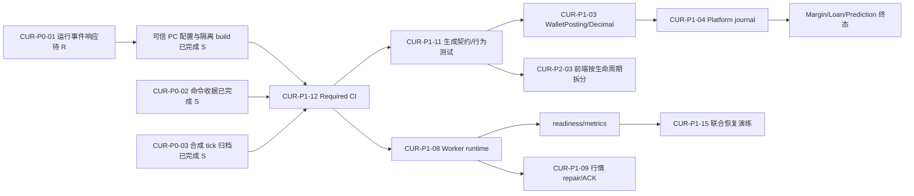

# 项目代码与业务优化复审报告（2026-08-30）

> **发布结论：代码 P0 已关闭 / 生产发布仍 HOLD。** 修复工作树已关闭 3 个严格 P0 并通过完整本地发布门禁；生产发布仍须完成供应链事件取证、凭据轮换、旧缓存/制品失效和生产数据对账，不能用代码测试替代这些运行证据。
> **证据基线：** 原始审计基线为 `main@fac1defff85d55d556949ec8b04b3c5a3f9e262a`（简称 `main@fac1def`）；P0 修复证据来自 2026-08-30 当前未提交工作树，尚未成为生产基线。
> **证据口径：** `S` 表示静态源码、配置、migration 或仓库测试证据；`R` 表示生产数据、真实拓扑、运行日志、制品或故障注入证据。`S=成立、R=待补` 不等于线上已发生损失。
> **执行边界：** 修复前未加载或执行异常配置；清理和静态门禁通过后，已在隔离环境运行 PC Vite build、全仓发布门禁及本机临时 MySQL/Redis 集成测试。未连接生产数据库、消息系统或云控制面，也未执行或披露任何历史解码 payload。

## 1. 执行摘要与发布决定

原始审计确认历史 12 个 P0 中，11 个已形成静态实现与回归骨架，另 1 个“事件时点结算”在外部行情链路已完成、但被合成行情旁路重新打开。随后建立的 P0 修复工作树已把三个当前发布阻断项全部关闭：构建输入静态门禁、三条资金命令强幂等，以及合成行情到秒合约事件时间结算闭环。核心事务、行锁、钱包流水、独立 migrator、Admin fail-closed RBAC、Mobile REST 权威对账和行情 generation fence 均被保留。

原始审计按“直接可达的资金、权限、结算、时间或不可恢复数据正确性”重新校准严重级别，不沿用研究代理标签。原始目录及当前状态为：

- **3 个 P0，代码均已关闭**：PC 构建期混淆远程代码加载器；高价值资金命令缺稳定客户端幂等；合成行情不进入秒合约事件时间结算历史。生产运行证据仍按本报告的 R 项补齐。
- **16 个 P1**：认证会话、MQ 钱包初始化、Decimal/过账、平台 journal、杠杆、借贷、预测/返佣、worker、行情、实时收敛、客户端资金契约、CI/migration、高风险命令边界、不可变交付与 Secret、灾备、客服归属可用性。
- **7 个 P2/热点组**：HTTP 公共边界、邮件交付、前端结构、Mobile 会话/提示、Admin 动作/异步状态表达、客户端能力/原生交付、Trellis/spec 治理。

### 1.1 当前根 Docker 工作流的精确边界

修复后的 `.github/workflows/docker-image.yml` 在四个构建/发布 Job 中都于 checkout 后、任何 Rust/Node setup、依赖安装和构建前执行 `scripts/source_integrity_gate.py`。`quality-gate` 随后调用 `scripts/p0-release-gate.sh`，该脚本对 PC 执行：

1. `npm --prefix pc run type-check`；
2. `npm --prefix pc run test:margin`；
3. `npm --prefix pc run build`，且扫描器锁定该入口必须保持为 `vite build`。

原始 HEAD blob 的 SHA-256 为 `556812c8ec8177751aa22b8fa641a92e782f9e2564866887061c6626186bd5f0`；该 IOC 已由扫描器固定阻断。工作树中的 `pc/postcss.config.js` 现只保留 Tailwind/Autoprefixer 声明式配置；扫描器同时覆盖全仓 executable build config 与 `package.json` lifecycle/受保护 pre/post hook/网络下载/动态执行/编码加载器，并且不 import、require 或执行任何目标文件。

清理后的本地完整发布门禁已经实际执行 PC `vite build` 并成功；GitHub workflow 也会调用同一门禁。任何清理前曾运行 PC Vite dev/build 的本地、CI、预览或原生环境仍属于供应链事件调查范围，必须通过日志、进程、网络和凭据使用记录补证。

### 1.2 解除发布阻断的最低条件

| 闸门 | 最低退出条件 |
| --- | --- |
| CUR-P0-01 | **代码已关闭。** 干净 PostCSS、前置静态门禁、16/16 scanner 回归、PC production build 和 Runbook 已完成；主机取证、凭据轮换、旧制品/cache 失效仍待 R 证据 |
| CUR-P0-02 | **代码已关闭。** Admin recharge、Spot create、Margin transfer 均强制稳定客户端 key + 请求指纹；真实 MySQL 验证重放、异参 409、主体隔离和 20 并发只动账一次 |
| CUR-P0-03 | **代码已关闭。** 合成 tick 经 lease/version/event-time fence 后先归档再进入 Redis/触发/广播；无能力 pair 拒绝激活/开仓；超龄无快照订单幂等进入可审计 `manual_review` |
| 发布证据 | required CI 的真实 MySQL/Redis/Mongo/Rabbit 分支不得静默 skip；发布制品可追溯到通过闸门的 immutable source/digest |

## 2. 当前强项

1. `src/bin/exchange-migrate.rs` 独立迁移，Compose 按依赖健康 → migration 成功 → API 启动，避免 API 运行期隐式迁移。
2. `src/modules/wallet/infrastructure/withdrawals.rs` 已把广播歧义保守化为冻结/查询/人工复核，历史双付根因已关闭。
3. `src/modules/spot/application/settlement.rs::settle_spot_fill` 使用稳定订单/钱包锁序、成交幂等与四腿同事务。
4. `src/modules/margin/application/account_settings.rs` 已实现全仓转出后风险复核；部分平仓和强平具备幂等事务骨架。
5. `migrations/0114_event_time_price_snapshots.sql` 与 `src/modules/seconds_contract/infrastructure.rs::select_settlement_price_snapshot` 已让外部行情秒合约按事件时间结算。
6. 新币权威定价/供给、解禁费真实动账、借贷 LTV/oracle/清算、预测本地关盘等历史 P0 已有当前实现。
7. `src/workers/market_feed.rs::MarketFeedGenerationFence` 关闭旧 provider generation 写入；Mobile 公共行情和 Margin 私有提示均有 REST 权威恢复边界。
8. Admin 设置编辑器具备 revision、reason、409 冲突和离页保护；后端未映射 Admin 路由继续 fail closed。
9. 当前镜像运行用户非 root，Tini/supervisor 能联动终止 Rust/Nginx；CI 已有发布前 quality job，虽覆盖仍不足。

## 3. 历史项完整状态映射

### 3.1 历史 P0-01..P0-12

| 历史 ID | 原问题 | 当前状态 | 当前静态证据 | 运行时/当前映射 |
| --- | --- | --- | --- | --- |
| P0-01 | 默认通配管理员 | **已完成（S）/R待补** | `src/bootstrap.rs::BootstrapAdminConfig::from_env`、`src/bin/exchange-migrate.rs` 已要求显式 bootstrap 并拒绝空/已知默认口令 | 首次生产 bootstrap、一次性改密与 Secret 注入待证；共同 CI 缺口只计 CUR-P1-12 |
| P0-02 | 提现广播歧义自动解冻 | **已完成（S）/R待补** | `src/workers/wallet_chain.rs::run_once_with_gateway` 与 `src/modules/wallet/infrastructure/withdrawals.rs` 保持 unknown frozen 并按稳定请求 ID 查询 | 查真实网关合同、unknown 队列和链上对账；不再列当前 P0 |
| P0-03 | 新币客户端定价/超供给 | **已完成（S）/R待补** | `src/modules/new_coin/infrastructure.rs::create_purchase_order`、migration `0111_new_coin_authoritative_issuance.sql` | 历史供给回填和生产并发对账待证 |
| P0-04 | 新币假缴解禁费 | **已完成（S）/R待补** | `src/modules/new_coin/infrastructure/unlock.rs` 将钱包、流水、平台腿与 paid evidence 同事务 | 费用账户和历史 paid 记录待对账 |
| P0-05 | 借贷无 LTV/oracle/清算 | **已完成原问题（S）/R待补** | `src/modules/loan/oracle.rs`、`src/modules/loan/liquidation.rs`、migrations `0112_loan_collateral_risk.sql`、`0113_loan_liquidation_accounting.sql` | 到期/总敞口是新的 P1，见 CUR-P1-06 |
| P0-06 | 秒合约按处理时最新价 | **代码已完成（S）/R待补** | 外部 feed 与合成 ticker 均进入 `market_price_ticks` 事件时间历史；`select_settlement_price_snapshot` 只按目标窗口选择权威快照 | strategy/internal 生产产品、超龄历史订单及人工复核队列仍须对账 |
| P0-07 | 预测结束/陈旧同步仍下注 | **已完成（S）/R待补** | `src/modules/prediction/service.rs` 与 `src/workers/prediction_market_close.rs` 本地 fail closed | 生产同步延迟、关盘积压待证；运营覆盖问题见 CUR-P1-07 |
| P0-08 | 闪兑报价 TOCTOU/陈旧价 | **已完成（S）/R待补** | `src/modules/convert/application.rs`、`src/modules/convert/infrastructure.rs` 以 MySQL quote 锁行、复核并一次消费 | 生产 quote freshness/对账待证 |
| P0-09 | 全仓转出无转后风险 | **已完成（S）/R待补** | `src/modules/margin/application/account_settings.rs` 与 `src/modules/margin/infrastructure/transfers.rs` 锁后复算 | 部分平仓/强平/转出交叉回归与生产多仓数据待证 |
| P0-10 | 行情旧 generation 继续写 | **已完成（S）/R待补** | `src/workers/market_feed.rs::MarketFeedGenerationFence`、`MarketFeedSupervisor::shutdown_active_generation` | 多实例 reload/disable 与 provider 运行指标待证；时间可信度见 CUR-P1-09 |
| P0-11 | PC 杠杆执行意图漂移 | **已完成（S）** | `pc/src/domain/marginActions.ts`、`pc/src/api/contract.ts`、`pc/tests/contract-margin-actions.test.ts` | 当前 PC 风险/读模型是 P1，不重复为 P0，见 CUR-P1-11 |
| P0-12 | Mobile 提现费用披露漂移 | **已完成（S）/R待补** | `mobile/src/core/withdrawalQuote.ts`、`mobile/src/views/WithdrawView.vue` 与后端 quote 合同 | 后端 MySQL 集成和生产 fee/version 待证；PC quote 漂移见 CUR-P1-11 |

### 3.2 历史 P1-01..P1-21

| 历史 ID | 当前状态 | 当前结论与唯一映射 |
| --- | --- | --- |
| P1-01 MQ 钱包初始化 | **开放** | publisher confirm/mandatory、topology、默认 consumer、缺钱包补偿未闭环 → CUR-P1-02 |
| P1-02 会话撤销伪成功 | **部分完成** | 错误吞掉已修；User/Agent 代际、刷新重放和提交后撤销仍开 → CUR-P1-01 |
| P1-03 5xx 原文泄露 | **开放但重校为 P2** | `src/error.rs::IntoResponse` 仍回显底层 Display；未证明直接 Secret 泄露或权限突破 → CUR-P2-01 |
| P1-04 提现网络/限频 | **部分完成** | asset-network/quote 已完成；PC quote 与 Redis 限频执行面仍开 → CUR-P1-11、CUR-P1-13 |
| P1-05 充值费/资产精度 | **开放、局部改善** | 提现/闪兑/新币部分量化；充值 fee 与共享 posting 未统一 → CUR-P1-03 |
| P1-06 现货语义/批量契约 | **部分完成** | 后端批量结果存在，Mobile 仍逐笔模拟；产品 ADR 未唯一 → CUR-P1-11、CUR-P2-06 |
| P1-07 杠杆计息/坏账/PC 风险 | **开放、局部改善** | 全仓坏账与转出闸门已补；计息、逐仓坏账、PC read model 未闭环 → CUR-P1-05、CUR-P1-11 |
| P1-08 返佣反冲/重试 | **开放** | 来源退款不反冲，retry 不持久 → CUR-P1-07、CUR-P1-08 |
| P1-09 平台双重记账 | **部分完成** | journal 已覆盖借贷/解禁费，其他核心域未覆盖 → CUR-P1-04 |
| P1-10 实时跨实例收敛 | **开放、Mobile 局部完成** | 进程内 hub 与 PC/Admin 恢复不足 → CUR-P1-10 |
| P1-11 worker 角色/监督/公平重试 | **开放** | market-feed 局部结构化；全局仍 detached、retry 不统一 → CUR-P1-08 |
| P1-12 行情时间/多实例配置 | **部分完成** | generation fence 已完成；future skew、跨库 repair、实例 ACK 未完成 → CUR-P1-09 |
| P1-13 migration/状态约束 | **部分完成** | fresh/re-run 测试存在但 CI 可 skip，无生产快照 upgrade/旧应用 lane → CUR-P1-12 |
| P1-14 CI/发布门禁 | **部分完成** | quality-gate 已加入；外部依赖/migration lane、不可变供应链和客户端原生制品验证仍缺 → CUR-P1-12、CUR-P1-14、CUR-P2-06 |
| P1-15 共享资金契约/行为测试 | **开放、局部改善** | 手写 DTO 与源码文本测试仍允许已发生漂移 → CUR-P1-11、CUR-P1-12 |
| P1-16 分层/巨型文件 | **开放** | WalletPosting owner 与客户端 mega-file 未收敛 → CUR-P1-03、CUR-P2-03 |
| P1-17 Admin/PC 运行边界 | **部分完成** | transport 有改善；资金 read model → CUR-P1-11，不可变交付 → CUR-P1-14，会话/动作状态/原生制品分别 → CUR-P2-04/05/06 |
| P1-18 readiness/指标/告警 | **开放** | `/health` 恒绿、required worker 无 heartbeat/metrics → CUR-P1-08 |
| P1-19 Docker/Secret/HA | **开放、局部改善** | 非 root/独立 migrator 已有；可变引用、key 无版本、资源/角色边界仍缺 → CUR-P1-14 |
| P1-20 多存储恢复 | **开放，R待补** | 仓库无可验证 PITR/联合 restore drill → CUR-P1-15 |
| P1-21 Trellis 状态失真 | **开放但重校为 P2** | 不直接满足 P1 业务风险口径；作为工程治理热点 → CUR-P2-07 |

## 4. 当前非重复发现目录

### 4.1 原始严格 P0 与当前修复状态

#### CUR-P0-01 — PC 构建期混淆远程代码加载器

- **修复状态（2026-08-30）：代码已关闭，R/IR 待补。** `pc/postcss.config.js` 已清理；纯文本扫描器覆盖 executable config 与全仓 `package.json`，四个 workflow 均在 setup/install/build 前执行；本地 P0 gate 已在清理后完成 PC production build。事件取证、凭据轮换及旧 Runner/cache/artifact/镜像失效继续按 Runbook 执行。
- **分类/级别：** 供应链与凭据边界，P0、立即事件响应及发布阻断。
- **当前证据：** tracked `pc/postcss.config.js` 是顶层混淆构建配置；基线 SHA-256 为 `556812c8ec8177751aa22b8fa641a92e782f9e2564866887061c6626186bd5f0`。`pc/package.json::scripts.build` 为 Vite build，`pc/src/main.ts` 导入 CSS，形成 PostCSS 配置加载路径。研究只做静态识别，未执行文件或 payload。
- **可达影响：** 运行 PC dev/build 的主机或 runner 可能执行远程变化代码，暴露源码、发布凭据、SSH/云/registry token，并污染制品或留下脱离父进程的持久活动。
- **增量整改：** 停止 PC 构建/发布/缓存复用；隔离可能运行过构建的主机；保全 Git/CI/EDR/DNS/进程证据；从可信来源恢复最小可审查配置；轮换可能暴露的凭据；增加配置恶意模式、Secret、依赖与外联扫描。
- **兼容/迁移/回滚：** 先冻结旧 PC 制品和 cache；在干净分支恢复已知良性配置，旧制品全部失效。数据库/API 无兼容变更。任何 clean build 必须等隔离与替换完成后在默认断网 runner 执行。
- **验证：** IOC hash 从所有活动分支、制品和 cache 消失；provenance 明确；隔离 build 无外联/异常子进程；凭据访问记录完成回溯。
- **工作量/依赖：** 代码 S；事件响应 M/L；依赖安全、DevOps、凭据 owner、主机/CI 日志。
- **运行时标记：** **S=成立，R/IR=待补。根 Docker workflow 仅 type-check + 一个 Node test，不含 PC Vite build，故未证明在该 workflow 执行；既往本地/其他 build 仍待查。**

#### CUR-P0-02 — 高价值资金命令缺少稳定客户端幂等身份

- **修复状态（2026-08-30）：代码已关闭，生产历史对账待补。** migration `0118_financial_command_idempotency.sql`、三条服务端事务和 Admin/PC/Mobile 重试适配器已统一强制客户端键、规范请求指纹、主体范围唯一收据及首次结果回放；legacy Spot 缺键建单端口已删除。真实 MySQL 已验证三条命令缺键拒绝、同参精确回放、异参 409、不同主体隔离及 20 并发只产生一次资金效果。
- **分类/级别：** 资金命令一致性，P0。
- **当前证据：** `src/modules/admin/presentation/users.rs::AdminUserRechargeRequest` 无请求键；`src/modules/admin/application/users.rs::recharge_admin_user_wallet` 每次生成新 UUID；`src/modules/spot/application/idempotency.rs::replay_spot_order_for_idempotency_key` 允许缺键继续；`src/modules/margin/application/account_settings.rs::normalize_transfer_idempotency_key` 缺键时生成服务端 UUID。
- **可达影响：** 超时、代理重试、双击或提交后断连可重复人工充值、重复建单/冻结/成交或重复划转。人工充值是直接余额增发路径，决定本项为 P0；其余同根因不重复计数。
- **增量整改：** 所有高价值命令强制客户端 `request_id/idempotency_key`；以主体+操作+key 唯一占位，保存请求指纹和首次响应；同键同参重放、异参 409；服务端临时 UUID 不再代表跨重试幂等。
- **兼容/迁移/回滚：** 先升级 Admin/PC/Mobile，再把可选字段转必填；新增 command receipt 表/唯一键；Spot 从全局 key 迁到 `(user_id,key)`；存量 NULL 只读兼容。新闸门可 feature flag 回退到“拒绝旧客户端”，不能回退为无 key 动账。
- **验证：** 并发 20 次、提交后断连、网关重试、同键异参；每场景仅一条业务记录、一组余额变化和一组流水。
- **工作量/依赖：** M，4–7 天；依赖 migration、三端合同和故障注入 harness。
- **运行时标记：** **S=成立，R=待补**；需扫描历史重复充值、订单和划转决定数据修复范围。

#### CUR-P0-03 — 合成行情未归档到秒合约事件时间结算历史

- **修复状态（2026-08-30）：代码已关闭，生产订单盘点待补。** migration `0119_synthetic_seconds_settlement_safety.sql` 为合成 tick 增加策略版本证据和秒合约异常终态；摄取链路先在 MySQL 持锁验证 owner/lease/version/event-time 并幂等归档，再更新 Redis、触发资金动作与广播；产品激活和开仓共用结算能力门禁；超龄缺快照订单只转一次 `manual_review` 并追加异常证据，不猜价也不自动改钱包。
- **分类/级别：** 结算/价格时点，P0。
- **当前证据：** `src/modules/seconds_contract/infrastructure.rs::lock_active_product` 未限制无归档能力的 pair；`src/modules/seconds_contract/application.rs::open_order` 取 Redis 入场价后扣本金；`select_settlement_price_snapshot` 只读 `market_price_ticks`。外部 feed 由 `src/workers/market_feed.rs::archive_ticker` 归档；合成路径 `src/modules/market/infrastructure/adapters/ingestion.rs::ingest_and_publish_synthetic_ticker` 不写该表；`src/workers/seconds_contract_settlement.rs::settle_order_by_id` 无快照时持续待结算。
- **可达影响：** strategy/internal pair 上可形成已扣款订单，却缺合法事件时间证据，订单可长期/永久 opened；使用 Redis 最新价补救会重新引入历史 P0 错时结算。
- **增量整改：** 把合成 tick 的 Redis 接受与 append-only `market_price_ticks(source=strategy)` 归入同一 generation/version fenced ingestion；修复前在产品保存和开仓拒绝无归档能力 pair；增加最大待结算年龄、异常队列和确定性本金退款/manual-review 状态机。
- **兼容/迁移/回滚：** 新 writer 可 additive 上线；历史缺价不可臆造回填。超龄订单进入人工复核，只按明确政策退款并写钱包流水、平台腿与审计。若新 writer 回滚，开仓闸门必须继续 fail closed。
- **验证：** strategy 开仓→合成 tick 归档→事件窗口结算；Redis/MySQL/Mongo 任一步失败、重复 tick、旧 generation、worker 重启、结算与超时退款竞争。
- **工作量/依赖：** L，1–2 周；依赖统一 ingestion port、状态 migration、异常运营页。
- **运行时标记：** **S=成立，R=待补**；立即统计 strategy/internal 秒合约产品及超龄 opened 订单。

### 4.2 当前 P1（16 项）

| ID | 分类/级别 | 当前文件+符号证据 | 可达影响 | 增量整改 | 兼容/迁移/回滚 | 验证 | 工作量/依赖 | R 标记 |
| --- | --- | --- | --- | --- | --- | --- | --- | --- |
| CUR-P1-01 | Auth/session，P1 | `src/modules/auth/mod.rs::claims_from_bearer_token`、`UserAuth`、`AgentAuth` 不回查账号代际；`src/modules/auth/service.rs::refresh_sa_token`、`issue_sa_tokens` 不消费旧 refresh 且跨存储非原子 | 停用/改密后 Redis 故障窗口旧 access 可用；被窃 refresh 可重复兑换 | User/Agent `auth_session_version`；refresh family 单次消费/轮换/CAS，重放撤销 family；失败补偿 access session | 列默认 0，旧 token 一次换新；双读后强校验；回滚仍保留版本拒绝 | 撤销存储故障后旧 token 下一请求拒绝；同 refresh 并发仅一次成功 | M/L，4–7 天；auth migration、Redis 原子脚本 | S成立；TTL、撤销失败审计待R |
| CUR-P1-02 | MQ/注册钱包，P1 | `src/modules/auth/application.rs::register_user_with_email_code` 只写 outbox；`src/modules/events/service/rabbitmq.rs::RabbitMqOutboxPublisher::publish` 无 broker confirm；`src/workers/event_inbox.rs::EventInboxWorkerConfig` 可正常停用；`create_wallet_accounts_for_user_in_tx` 是唯一初始化 | outbox 可显示 published 而新用户缺钱包 | confirm+mandatory/return；版本化 queue/binding/DLX；consumer required readiness；`users×assets` 幂等 reconciler，或同步 provisioning port | 保留 exchange/key/message ID；先建新 topology 再切 required；补偿只插缺行 | ACK/NACK/unroutable/断线；fresh Compose 注册钱包覆盖 100% | M/L，5–8 天；Rabbit IaC、集成环境 | S成立；生产 topology 与缺行数量待R |
| CUR-P1-03 | Decimal/WalletPosting/充值费，P1 | `src/modules/earn/service.rs::validate_amount` 只守 18 位；`src/modules/spot/application/settlement.rs::settle_spot_fill`、`src/modules/margin/application/open_position.rs::validate_product_margin`、`src/modules/convert/infrastructure.rs::settle_convert_order_in_tx` 各自写钱包；`src/modules/wallet/infrastructure/deposits.rs::credit_deposit_event_in_tx` 未执行 deposit fee；PC/Mobile mutation 广泛先转 JS Number | 超资产精度 dust、ledger amount 与真实 delta 漂移、充值费配置与实际入账不一致；未证明直接损失故定 P1 | transaction-aware `WalletPostingPort`；decimal string 输入；按 `assets.precision_scale` 拒绝/向零量化；deposit 固化 gross/fee/net/rule version | 先画像和 shadow；存量不静默改余额，以 adjustment 交易修正；按 wallet→earn/convert→spot/margin 迁移 | scale 0/2/8/18、既有 dust、冲正、部分成交；逐笔 `ledger.amount=after-before` | L，1–3 周；财务规则、Decimal 库、数据清理 | S成立；非零 fee 与 dust 规模待R |
| CUR-P1-04 | 平台 journal/对账，P1 | `migrations/0110_platform_financial_journal.sql` 已存在；生产写入集中于借贷与新币解禁，充值、提现、spot/margin、convert、earn、seconds、prediction、commission 未统一写对手腿 | 无法按资产证明托管、清算、手续费、应收、坏账守恒 | 建 treasury/clearing/fee/insurance/bad-debt 科目；同事务 shadow journal；每日 reconciliation | 先 shadow，不替换钱包权威；只按可证明业务 ref 回填，未知历史进差异队列 | 每 transaction/asset 分录和为 0；删/重一腿必告警；余额可重演 | XL，3–6 周起；科目政策、CUR-P1-03 | S成立；托管/历史数据待R |
| CUR-P1-05 | Margin 计息/坏账，P1 | `src/workers/margin_interest.rs::accrue_position_interest` 用当前利率并丢小时余数；`src/workers/margin_liquidation.rs::liquidate_position_by_id` 将逐仓负 equity 截零，`liquidate_cross_account` 已记录全仓坏账 | 调度分片/改率影响利息；逐仓穿仓损失不可见 | rate/version 有效期、checkpoint 保留余数；逐仓 bad_debt 与保险/平台腿同事务 | 从当前游标启用新口径，不追溯重算除非政策批准 | 60/90/随机分片相同；改率分段；负 equity 只记录一次 | L，2–4 周；计息/保险政策、CUR-P1-04 | S成立；历史改率和负 equity 待R |
| CUR-P1-06 | Loan 生命周期/敞口，P1 | `src/workers/loan_overdue.rs::mark_order_overdue` 只改状态；`src/modules/loan/liquidation.rs::fetch_loan_liquidation_candidates` 仅抵押/LTV；`src/modules/loan/service.rs::calculate_interest_amount` 到期限即停止；创建/审批无用户总敞口锁 | 信用贷或低 LTV 抵押贷可长期逾期；多单规避单笔上限；无补抵押/部分还款自救 | 快照 grace/default/write-off/restructure 政策；并发安全 exposure row；补抵押/部分还款/运营待办 | 新订单必填；历史 overdue 进 manual review，不倒算罚息；旧全额还款兼容 | 到期/还款/清算竞争、信用贷、低 LTV、exposure 并发与平台腿 | XL；产品/法务/财务政策、migration/Admin/clients | S成立；账龄/本金/产品政策待R；严格降为P1 |
| CUR-P1-07 | Prediction/commission 终态，P1 | `src/modules/prediction/application.rs::update_admin_market` 的隐藏可被 `sync_polymarket_markets_inner` 覆盖；`settle_market_in_tx` 单事务锁全场且终态重放不核意图；invalid refund 不处理 `insert_agent_business_commission_in_tx` 生成的佣金 | 风险 hold 可消失；poison 订单阻断全场结算；退款后仍发佣金 | source status 与 operator hold 分离；actor/reason/revision；持久 settlement job 分批 claim；请求 fingerprint；佣金 source 终态复核和 reversal | 原 endpoint 内部创建 job；legacy hidden 保守映射 hold；已结佣金用反向交易不改旧流水 | 十万单、崩溃续跑、相反结果重放、退款与佣金并发、对账 counts | XL；job/reversal migration、CUR-P1-04、Admin UI | S成立；市场规模/历史退款佣金待R |
| CUR-P1-08 | Worker/job runtime，P1 | `src/main.rs::main` 对全部 worker `tokio::spawn` 后不监督；earn/commission/unlock 固定头部或内存 guard；`execute_admin_market_strategy_recovery` 在 HTTP 内运行，`claim_market_strategy_recovery_job` 无 owner/fence/heartbeat | API 扩容重复 owner；worker 退出仍健康；poison 饿死后项；K线恢复可并发重领/终态竞争 | `PROCESS_ROLE`、WorkerRegistry/JoinSet、required heartbeat；lease+fence；持久 attempt/next/dead-letter；独立 recovery worker | 默认 `all` 保持单实例；additive job 字段；逐 worker 切换 | 2 API+1 worker、panic、SIGTERM、poison、lease 过期、旧 fence terminal write 拒绝 | L，2–4 周；部署角色、job schema、监控 | S成立；实例数/backlog/退出日志待R |
| CUR-P1-09 | 行情时间/跨存储/配置，P1 | `MarketTickerSnapshot::with_24h` 无 future skew；`SAVE_TICKER_IF_FRESH_SCRIPT` 只比递增；`rest_payload_observed_millis` 缺源时间时填本机 now；`ingest_kline` 先 Redis 后 Mongo且同帧重试可被 CAS 拒；`reload_admin_market_feed_config` 只代表命中实例 | 未来帧锁死缓存、旧 REST 冒充新价、Mongo 永久缺 candle、多副本版本漂移 | provider/received time 分离和 trust；future quarantine；Redis成功/Mongo失败 repair job；实例 version ACK | DTO additive 双写；上线前隔离 future key；env 仅显式 bootstrap | future+1 拒绝后正常帧可写；half-commit 最终 Mongo 一条；全实例同版才 success | M/L，5–10 天；provider SLO、repair job、instance ID | S成立；实际 skew/gap/副本待R |
| CUR-P1-10 | Realtime 收敛，P1 | `src/modules/events/service/websocket.rs::EventBroadcastHub` 进程内、可 lag；`pc/src/api/stomp.ts::scheduleReconnect` 无入站 watchdog/版本对账；`web/src/api/marketTickerSocket.ts::subscribeMarketTicker` 每调用新 socket 且无恢复；Mobile 是正确参照 | 跨实例/重启/半开时 PC/Admin 可长期陈旧；未证明直接动账故 P1 | WS 仅提示；open/reconnect/gap/周期 REST snapshot；sequence/resync；共享 bus；Admin multiplex | envelope additive、保留现有路径/facade；先补 REST 再换 bus | 双实例 A 产事件/B 连客户端、lag/乱序/重启后各端收敛 | L，2–4 周；读模型版本、共享 bus、三端 harness | S成立；LB/sticky/副本待R |
| CUR-P1-11 | 客户端资金契约/读模型，P1 | `pc/src/api/backendAdapters.ts::mapMarginWalletsToContractWallets` 丢 `cross_accounts`，seconds `closePrice: 0`；`pc/src/api/wallet.ts::submitWithdraw` 缺 quote；`mobile/src/api/trading.ts::cancelAllSpotOrders` 逐笔模拟已有批量端点 | PC 风险/结算历史失真、提现不可用、Mobile 批量失败被抹平；服务端仍保护动账，严格定 P1 | 补核心 OpenAPI/生成 transport DTO；严格 decoder；消费权威 risk/settlement/withdraw quote/batch failures | 新 namespace 与旧 mapper 并行；additive nullable risk/settlement 字段；旧 payload 只显示 `--` 或禁用写操作 | 改字段/枚举/quote_id 时 CI 失败；多 pair risk fixture；部分失败；九状态 withdrawal | L/XL，8–15 天分域；backend schema、frontend harness | 多数S成立；误差/用户暴露量待R |
| CUR-P1-12 | CI/migration 集成门禁，P1 | `scripts/p0-release-gate.sh` 有 Rust/web/PC/mobile gate，但 workflow 无外部 services；多 integration test 缺 URL 即 skip；PC 只 type-check+一个 Node test；无 production snapshot upgrade/old-app lane | 绿色发布不能证明数据库事务、migration、Redis/Mongo/Rabbit 分支或关键客户端资金合同 | required MySQL8.4/Redis/Mongo/Rabbit lane，skip=0；fresh/upgrade/re-run/old-app smoke；全量资金合同/行为测试；客户端制品交付另由 CUR-P2-06 收口 | 先 observation 后 required；migration expand-contract；不得以运行当前可疑 config 获取证据 | 每 lane 故意破坏均阻断；required executed count；合同 fixture 漂移阻断 | M/L，1–4 周；CI services、fixture、branch protection | S成立；Actions/branch protection日志待R |
| CUR-P1-13 | 提现限频/人工资金命令边界，P1 | `src/modules/wallet/application.rs::create_withdrawal_request` 向 risk control 传 `None`；`src/modules/spot/routes.rs::fill_orders` 与后台充值/冲正入口不把 admin actor/reason 传入同一资金事务 | 提现跨实例限频不执行；敏感人工资金操作无法原子追责 | Redis limiter 明确 fail-closed/受控降级；统一 `CommandActor+reason+request_id` receipt 同事务 | 保留 HTTP 状态/code；reason 先 optional 告警后 required；旧 worker 显式标记 system actor | 双实例 N+1；审计失败与资金同时回滚；重放不增加收据 | M，3–5 天；request ID、风险策略、Admin UI | S成立；规则启用率/历史操作者待R |
| CUR-P1-14 | 不可变交付/Secret 生命周期，P1 | workflow Action 用浮动 major；base/service/Compose image 多为可变 tag；`src/infra/secrets.rs::encrypt_secret`/`decrypt_secret` envelope 无 key_id/version | 同源码可解析成不同供应链输入；密钥丢失/轮换会使历史密文不可恢复 | Action SHA、image digest、SBOM/provenance/签名；统一 toolchain/typed env；key version 双读单写+escrow | 旧新 key 并行；immutable digest 回滚应用但不逆 migration | attestation subject 匹配；策略拒绝浮动引用；旧新 key 迁移/恢复 canary | M/L+运维；registry、KMS、签名 | S成立；部署 digest/KMS/1Panel能力待R |
| CUR-P1-15 | 跨存储灾备，P1 | `docker-compose.example.yml` 只有 volumes/AOF；`docs/deployment/docker.md` 只有局部人工备份说明；仓库无通用 PITR/联合 restore drill | MySQL/Mongo/Rabbit/Redis/uploads/密钥错点恢复，RPO/RTO 不可证明 | MySQL full+binlog、Mongo snapshot/oplog、Rabbit definitions/policy、uploads、key escrow；隔离恢复后业务对账 | 不改在线 API；先备份与隔离演练；缓存/锁不盲目恢复 | 从指定时点空环境恢复；钱包/journal/event/Kline/files/decrypt canary 全通过 | L/运维，2–6 周起；存储商、KMS、隔离环境 | 仓库S成立；生产备份能力与最近演练待R |
| CUR-P1-16 | 客服归属可用性，P1 | `src/modules/support/infrastructure.rs::resolve_active_support_agent_in_tx` 拒绝 inactive 链；`src/modules/admin/application/agents.rs::update_admin_agent_status` 不主动清理既有会话，`src/modules/support/infrastructure.rs` 的 Admin `unassigned` 只筛 `assigned_agent_id IS NULL`，仅后续用户请求触发惰性同步 | inactive owner 的 open 会话既无法被旧代理处理，也不进入未分配队列，可造成持续客服漏单/SLA 中断 | 代理状态事务 set-based 清空或转 fallback，清 staff cursor，记录 affected count/audit；增加存量 reconciler | `assigned_agent_id` 已 nullable；上线先扫描 inactive ancestry，保留 referral 关系；恢复 active 时显式重派 | 停用直属代理/祖先后，无需用户新消息即在 Admin 接管队列可见，旧代理仍被拒绝 | M，2–4 天；support/agent 事务、运营政策 | S成立；陈旧会话数/SLA 待R |

### 4.3 当前 P2 / 结构热点（7 组）

| ID | 分类/级别 | 当前文件+符号证据 | 影响 | 增量整改与兼容/回滚 | 验证 | 工作量/依赖 | R 标记 |
| --- | --- | --- | --- | --- | --- | --- | --- |
| CUR-P2-01 | HTTP 公共边界，P2 | `src/lib.rs::build_router` 使用 `CorsLayer::permissive()`；`src/error.rs::IntoResponse` 把底层 `Display` 放入响应 | 来源边界依赖仓库外网关；5xx 可能暴露内部实现信息，但静态证据未证明直接 Secret 泄露或权限突破 | production Origin allowlist fail-fast；5xx 仅返回稳定 public code/message/error_id，完整链留结构化日志；开发保留显式宽松 profile；保持现有 HTTP status/public code，均可按 profile 回退 | 非 allowlist Origin 被拒；故障注入响应不含内部 marker，日志可按 error_id 关联；合法 Web/PC/Mobile 不受影响 | S/M，1–3 天；域名清单/WAF/错误合同 | S成立；网关配置与真实错误样本待R |
| CUR-P2-02 | 邮件交付，P2 | `src/modules/auth/application.rs::send_registration_email_code`、`send_email_code_for_purpose` 与 `src/modules/user/application.rs::send_user_email_bind_code` 先提交冷却再 SMTP | 瞬态失败消耗冷却且无 durable 状态 | delivery state/受控 outbox，不保存明文验证码；旧同步接口兼容状态查询 | SMTP 故障进入 failed/retry，不错误宣称 sent | M；邮件安全策略/provider | S成立；provider delivery待R |
| CUR-P2-03 | 前端结构/性能热点，P2 | `mobile/src/views/TradeView.vue` 6081 行、`SecondsView.vue` 2818 行；`prototype-base.css` 8034 行；`pc/src/api/backendAdapters.ts` 2101 行；`web/src/admin/resources/resourceConfigs.tsx` 1469 行 | 生命周期 owner 混杂、review/merge 与 bundle/CSS 风险 | 先 characterization，再按 session/adapter/workspace/CSS layer 提取；保留页面、路由、DOM/CSS façade | start/stop/ABA、视觉 320/390/448、chunk/CSS budget | XL，3–6 周；CUR-P1-11/12 | 行数S；性能待R |
| CUR-P2-04 | Mobile 会话/私有提示，P2 | `mobile/src/stores/session.ts` 与 `mobile/src/api/client.ts` 双 token owner；`mobile/src/api/privateUserStream.ts::createPrivateUserStream` 仅 TradeView 使用；Support 只由 `mobile/src/core/supportChat.ts::createSupportPollingController` 五秒轮询 | refresh 后 store/socket epoch 不同步；support hint 未消费，半开私有 socket低延迟恢复差；REST仍保正确性 | 单一 session service；topic lease private manager+入站 watchdog；保留五秒 REST | refresh 后 header/store/socket一致；静默重连；最后 lease 清理 | M/L；fake socket/timer | S成立；半开频率待R |
| CUR-P2-05 | Admin 动作权限/异步状态表达，P2 | `web/src/admin/resources/resourceConfigs.tsx` 以动作组 `.some(...)` 决定整组展示；`pc/src/stores/contract.ts`、`pc/src/stores/second.ts` 多个失败分支仅 `console.error`，没有稳定 error/stale 状态 | 低权限用户可看到最终被后端 403 的按钮；请求失败可能显示为空或旧数据。后端仍 fail closed，未证明权限突破或直接资金错误 | 每个 action descriptor 绑定精确 permission；read model 增加 loading/error/stale/lastSuccessfulAt；保留后端授权与现有成功 payload，前端按字段渐进启用并可回退旧 façade | 多角色 fixture 逐动作断言；超时/500/离线均显示错误或 stale，不伪装为空态；成功路径不变 | M，2–4 天；Admin RBAC 清单/客户端 store owner | S成立；真实 403 与空态频率待R |
| CUR-P2-06 | 客户端能力/原生交付一致性，P2 | `pc/src/views/SecondOptions.vue` 对 guest 整页 guard；PC 尚未曝光后端 1..100% 部分平仓；现货订单簿/柜台 ADR 未唯一；`pc/src-tauri/tauri.conf.json`、`mobile/src-tauri/tauri.conf.json` 及 capabilities 未进入 required 制品验证 | 公开发现、已实现能力和产品语义未完整进入客户端；原生制品问题可能延迟到发布阶段，但无当前可达执行绕过证据 | public/private state 拆分；capability-gated 部分平仓；补 ADR；加入原生 build/smoke、最小 CSP/capability 与签名/updater 验证；保留全平 100% 和现有发布通道，分平台灰度/回滚 | guest 无私有请求；1/37/100% 重放；产品文案一致；PWA 与三平台 Tauri 制品启动、权限和 updater 回滚通过 | M/L；产品决策、签名环境、CI（须在 CUR-P0-01 处置后） | S成立；转化与现网原生制品待R |
| CUR-P2-07 | Trellis/spec 治理，P2 | `.trellis/tasks/` 长期活动状态多套完成语义；`.trellis/spec/backend/logging-guidelines.md` 仍为模板，error/database 总则不完整 | 交付真相、owner 与复核证据漂移 | 统一 completed/归档；7/30天 stale owner；archive 写 commit/PR/digest；补可执行 spec；不影响生产代码 | 30天无owner活动任务=0；空 context 不通过；spec 核心无占位 | S/M；团队 owner/Trellis validator | S成立；组织流程待R |

## 5. 核心业务保护矩阵

| 核心流 | 当前有效保护 | 当前缺口/唯一发现 | 权威恢复与验收 |
| --- | --- | --- | --- |
| 注册与钱包初始化 | 用户、推荐关系、outbox 同 MySQL 事务；钱包初始化 `INSERT IGNORE` | CUR-P1-02 MQ false-success/consumer/topology | 注册后 `users×active assets` SLA 100%；断 MQ 后补偿 |
| 认证/停用/改密 | user/admin/agent scope 分离；Admin 有状态/代际回查 | CUR-P1-01 refresh 重放与 User/Agent 代际 | 旧 token 下一请求拒绝；refresh family 单次消费 |
| 充值/人工充值 | 链事件唯一键；人工充值主体范围收据、指纹、钱包、流水、审计与响应快照同事务 | CUR-P1-03 fee/precision；CUR-P1-13 actor/reason | gross=fee+net；同 key 一次；冲正按原快照 |
| 提现 | quote 一次消费；available→frozen；unknown 保持冻结 | CUR-P1-11 PC quote/status；CUR-P1-13 限频；CUR-P1-04 journal | quote=冻结额；unknown 不释放；双实例限频 |
| 现货 | 服务端执行价、稳定锁序、强制主体范围幂等键、首次响应快照、成交幂等、批量端点 | CUR-P1-03 precision；CUR-P1-11 Mobile batch/客户端 Decimal | 同 key 一次、部分失败完整、每资产守恒 |
| 杠杆 | 划转强制主体范围幂等键；全仓转出风险闸门；部分平仓/强平幂等；Mobile REST 对账 | CUR-P1-05 计息/坏账；CUR-P1-11 PC 风险 | 调度无关利息；坏账 journal；后端风险逐字段一致 |
| 秒合约 | 外部与合成 feed event-time snapshot；能力门禁；超龄缺价转可审计 `manual_review`；订单/扣款/流水同事务 | CUR-P1-11 PC settlement display；生产历史异常订单待 R 对账 | 延迟/重放同一 snapshot；无证据订单不猜价且进入受控终态 |
| 闪兑 | MySQL quote 权威、锁行复核、稳定钱包锁序、一次消费 | CUR-P1-03 posting delta/Decimal；CUR-P1-04 清算腿 | Redis 故障政策明确；quote/ledger/account delta 一致 |
| 借贷 | 申请/审批双重 oracle/LTV；清算幂等和部分平台腿 | CUR-P1-06 到期/敞口/自救 | 到期、还款、清算竞争唯一；exposure 原子释放 |
| 理财 | 申购/赎回事务；费用快照；手工/自动复用路径 | CUR-P1-03 precision；CUR-P1-08 retry；CUR-P1-04 liability | 自动/手工同量化；poison 不饿死；负债平衡 |
| 预测 | quote 消费、本地 DB 时间关盘、钱包事务 | CUR-P1-07 operator hold/批结算/佣金 reversal | end_at 后 0 单；job 可续跑；退款前后净佣金一致 |
| 新币 | 权威定价、供给 reserve/finalize、解禁费真实动账 | CUR-P1-04 销售/发行平台腿；CUR-P1-08 unlock retry | allocated≤supply；费用/释放重放一次；平台腿平衡 |
| 代理返佣 | 来源事务内差额佣金、source key 幂等 | CUR-P1-07 source finality/reversal；CUR-P1-08 持久 retry | 来源终态复核；正反腿按 source_id 对账 |
| 在线客服 | MySQL/REST 权威、精确 owner、消息 client ID、游标分页 | CUR-P1-16 停用联动；CUR-P1-10 跨实例提示 | 漏全部 WS 仍可重建；inactive owner 立即进入接管队列 |
| 行情/恢复 | generation/lease/version fence、synthetic MySQL 先归档、provider liveness、Redis CAS、Mongo 唯一 upsert | CUR-P1-09 time/repair/config；CUR-P1-08 recovery job | future 隔离、跨库 repair、全实例 ACK、恢复 fence |
| Admin 配置/操作 | 后端 fail closed RBAC；多数设置有 revision/reason/audit | CUR-P1-07 prediction 旁路；CUR-P2-05 动作权限/状态；CUR-P1-13 人工资金审计 | 每动作精确权限；actor/reason 与资金同事务 |

## 6. 代码与结构热点

以下行数按 `main@fac1def` 的 tracked 内容计算，仅用于定位，不作为严重级别本身。

| 路径/符号 | 行数 | 热点 | 增量边界 |
| --- | ---: | --- | --- |
| `mobile/src/views/TradeView.vue` | 6081 | Spot/Margin、两类 WS、REST generation、动作、弹层、样式共一 owner | `useMarketDetailSession`、`useMarginAccountSession`、mutation intent 与 workspace 分批提取 |
| `mobile/src/views/SecondsView.vue` | 2818 | 行情、倒计时、下单、结果队列和样式混合 | product/market/private-order/result composables |
| `mobile/src/views/AssetsView.vue` | 2046 | 多账户、划转、picker 与展示共一页 | account projection、transfer intent、sheet components |
| `mobile/src/styles/prototype-base.css` + `prototype-parity.css` | 11720 | 大型全局 cascade 与 specificity 风险 | 按稳定 visual layer 拆分并设置 CSS budget |
| `pc/src/api/backendAdapters.ts` | 2101 | 多域手写 DTO、Number 转换、默认值/丢字段 | 生成 transport namespace + 领域 mapper |
| `pc/src/i18n/index.ts` | 2222 | locale/领域单文件 | 按 locale/领域拆分，key/placeholder 对等检查 |
| `web/src/admin/resources/resourceConfigs.tsx` | 1469 | 所有资源/action 静态聚合，动作权限粗粒度 | 领域动态 config、action descriptor 精确 permission |
| `src/modules/prediction/infrastructure.rs` | 1875 | sync/order/settlement/钱包/佣金同文件 | repository/quote/order/settlement job 按职责拆分 |
| `src/modules/loan/infrastructure.rs` | 1686 | 产品、订单、钱包、平台腿、查询集中 | loan repository、posting adapter、read model 分离 |
| `src/modules/admin/infrastructure/wallet_assets.rs` | 1170 | Admin 跨域资金/资产适配 | owner context public API；Admin 只保留 RBAC/audit façade |

## 7. 运行时与生产证据清单

| 证据包 | 必查内容 | 通过标准 | 关联决定 |
| --- | --- | --- | --- |
| PC 构建事件 | 哪些主机/CI run 执行过 PC dev/build；进程/DNS/HTTP/EDR；Git provenance；Secret 使用日志 | 范围、时间线、凭据轮换和制品失效均有 owner/记录 | CUR-P0-01，发布前必需 |
| 幂等重复画像 | Admin recharge、Spot order、Margin transfer 同主体/近时/同参数重复 | 重复范围量化；每笔处置有财务结论 | CUR-P0-02 |
| 秒合约异常 | strategy/internal 产品、超龄 opened、`market_price_ticks` 缺口 | 风险产品关闭；每个订单有结算证据或审计终态 | CUR-P0-03 |
| 历史 P0 对账 | bootstrap、unknown withdrawal、new-coin supply/unlock、loan LTV、prediction close、convert quote、cross transfer | 12 项均有生产查询、结果、owner，不以静态测试替代 | 历史关闭证据 |
| RabbitMQ | exchange/queue/binding/DLX/policy、confirm/return、consumer 配置、users×assets 差集 | topology 版本化；unconfirmed 不标 published；差集 0 | CUR-P1-02 |
| 数据库/migration | `_sqlx_migrations` checksum/dirty、MySQL 版本、生产快照 upgrade、非法状态/金额画像 | fresh/upgrade/re-run/old-app lane 均真实执行且 skip=0 | CUR-P1-12 |
| Worker/实时拓扑 | API/worker 实例数、owner、退出日志、backlog oldest age、WS sticky/shared bus | required worker 可判定；双实例漏提示后 REST 收敛 | CUR-P1-08/10 |
| 行情时间与跨库 | future key、provider skew、Redis/Mongo gap、配置版本 ACK | future 毒化 0、未修复 gap 0、全部实例同版 | CUR-P1-09 |
| 财务对账 | 资产 precision dust、deposit_fee 非零配置、孤立/不平衡 platform legs、逐仓 bad debt | 差异均有 adjustment/owner，不能静默改历史 | CUR-P1-03/04/05 |
| 借贷/预测/返佣/客服 | overdue 账龄/本金、用户总敞口、invalid refund 后佣金、settlement transaction size、inactive owner open 会话 | 高龄/异常项进入受控队列；政策和账务可解释；客服陈旧归属为 0 | CUR-P1-06/07/16 |
| 发布/Secret/原生 | 实际部署 digest、attestation、Action policy、KMS/key escrow、原生更新签名 | 部署 digest 对应已验证 source；key 可轮换/恢复；原生制品可验证回滚 | CUR-P1-14/CUR-P2-06 |
| DR/可观测 | 最近备份、PITR、restore drill、RPO/RTO、告警与 on-call | 空环境联合恢复并通过业务 canary；测得目标获批准 | CUR-P1-15/08 |

## 8. 依赖顺序

固定原则：先事件响应和 P0 fail-closed，再让 required CI 证明；然后补契约、worker/行情恢复；最后迁移 WalletPosting/journal 和结构热点。不得用大重写替代兼容迁移。

## 9. 0–24 小时行动

1. **立即冻结 PC dev/build、PC 发布、相关 cache 与既有未签名制品**；不执行当前 `pc/postcss.config.js`，不取回或运行任何 payload。
2. 隔离可能运行过 PC Vite/PostCSS 的开发机和 runner；先保全 Git/CI/shell/process/network/EDR/Secret 使用日志，再清理。
3. 建立事件时间线与 provenance：文件首次出现的 commit/author/PR、触发过的 workflow/本地命令、访问过的凭据；按暴露面轮换 GitHub/npm/GHCR/云/SSH/数据库/部署凭据。
4. 在 branch/environment protection 上设置临时 release hold；所有旧 PC artifact/cache 标记不可发布。
5. 服务端已经在动账前拒绝无稳定 key 的 Admin recharge、Spot create、Margin transfer；部署时同步升级三端，并统计仍在发送旧合同的客户端请求。
6. 服务端已经禁止无事件历史归档能力的秒合约产品激活/开仓；部署后导出存量 strategy/internal 产品与超龄 opened 订单，逐笔核对结算证据或人工复核终态。
7. 指定 P0 owner、24h 状态更新、数据/运行证据 owner；任何“未发生”结论必须有查询或日志，不以源码推断。

## 10. 30/60/90 天路线图

| 时段 | 交付重点 | 退出指标 |
| --- | --- | --- |
| 0–30 天 | CUR-P0-01/02/03 代码与故障测试已完成；继续补供应链 IR/凭据/制品和生产对账 R 证据；建立 required 外部依赖 CI；补 User/Agent session version、5xx redaction、Admin command actor/reason | 3 个 P0 的 R 证据也关闭；required integration skip=0；PC clean build 仅使用可信源码与失效后的缓存；旧 token 下一请求拒绝 |
| 31–60 天 | Rabbit confirm/topology/reconciler；WorkerRegistry/role/lease/retry/readiness；行情 time trust/repair/config ACK；PC/Admin/Mobile 生成契约与行为测试；Loan/Prediction 终态设计 | fresh 注册钱包覆盖 100%；required worker 120 秒内可判停摆；双实例实时最终收敛；schema drift 可在 PR 阶段阻断 |
| 61–90 天 | WalletPosting/Decimal 分域迁移；shadow platform journal；Margin/Loan/Prediction/commission 账务收口；immutable release/Secret key version；联合 restore drill；前端热点按生命周期拆分 | 目标域无未授权直接钱包 SQL；shadow journal 每资产平衡；完成一次联合恢复且不超批准 RPO/RTO；热点 composable 均有 start/stop/ABA 测试 |

## 11. 推荐 Trellis 任务拆分

| 建议任务 | 范围 | 关键验收 | 依赖 |
| --- | --- | --- | --- |
| `pc-build-loader-incident-response` | CUR-P0-01 取证、清理、凭据、制品 | IOC 清零、provenance/轮换完成、隔离 build 无外联 | Security/DevOps |
| `financial-command-idempotency-receipts` | Admin recharge/Spot/Margin | 同 key 同参一次、异参 409、断连重试一次 | migration/clients |
| `synthetic-tick-event-time-settlement` | 合成行情→结算历史→超龄订单 | strategy order 可结算；无证据 fail closed/审计退款 | market/seconds |
| `auth-session-generation-refresh-rotation` | User/Agent version、refresh family | 旧 token 即拒绝；refresh 并发仅一次 | Redis/migration |
| `user-wallet-provisioning-delivery` | Rabbit confirm/topology/reconciler | unconfirmed published=0；钱包差集=0 | Rabbit IaC |
| `financial-ci-migration-matrix` | services、skip=0、资金合同 fixture、upgrade | 每 lane 故意破坏均阻断 publish | P0 loader 先处置 |
| `generated-financial-contracts` | wallet/margin/seconds/spot transport | schema freshness 与 golden fixtures required | OpenAPI/CI |
| `worker-runtime-supervision-readiness` | role/registry/lease/retry/metrics | 2 API+1 worker 唯一 owner；panic 可判定 | deployment |
| `market-time-cross-store-repair` | future skew、Redis→Mongo repair、ACK | future 后正常帧恢复；gap=0；全实例同版 | worker/metrics |
| `wallet-posting-decimal-precision` | 共享 posting、deposit fee、客户端 Decimal | ledger delta 一致；scale 0/2/8/18 | data policy |
| `platform-shadow-journal-reconciliation` | 平台科目与 shadow legs | 每 transaction/asset 平衡 | finance/WalletPosting |
| `margin-interest-isolated-bad-debt` | rate version、checkpoint、坏账 | 任意分片利息一致；坏账一次 | journal/policy |
| `loan-maturity-exposure-lifecycle` | overdue/default/write-off/exposure/self-rescue | 到期竞争唯一、exposure 原子释放 | product/legal/finance |
| `prediction-settlement-commission-finality` | hold、batch job、fingerprint、reversal | 可续跑；退款前后净佣金一致 | journal/Admin |
| `realtime-multi-instance-reconciliation` | sequence/resync/shared bus/REST | A 产事件/B 连接后最终一致 | read-model version |
| `immutable-delivery-secret-rotation` | Action/image pin、attestation、Secret key version | digest 可追溯；旧新 key 轮换/回滚通过 | registry/KMS |
| `support-agent-status-assignment-reconciliation` | CUR-P1-16 状态联动、存量 reconciler、接管审计 | 停用后无需新消息即进入接管队列；陈旧归属为 0 | support/agent policy |
| `client-native-delivery-capability` | CUR-P2-06 guest/capability/ADR/PWA/Tauri | 1/37/100% 一致；三平台制品、权限、updater 可验证回滚 | P0 事件处置/产品/签名 CI |
| `cross-storage-restore-drill` | MySQL/Mongo/Rabbit/Redis/uploads/key | 空环境指定时点恢复+业务 canary | infra/KMS |
| `frontend-lifecycle-hotspot-slices` | Mobile/PC/Admin 热点 | 页面 façade 不变；start/stop/ABA/视觉门禁 | generated contracts |
| `trellis-truth-and-spec-governance` | 状态/归档/commit 证据/spec | 30天无owner=0；核心 spec 无占位 | team owners |

## 12. 审计结论与限制

### 审计结论

`main@fac1def` 原始基线仍不满足发布条件；当前修复工作树已经独立关闭三个代码 P0：**PC 构建供应链加载器与前置门禁、高价值资金命令强幂等、合成行情与秒合约事件时间结算闭环**。完整发布门禁和本机真实 MySQL/Redis 故障/并发测试均已通过。生产发布继续 HOLD 的决定性原因已从代码缺口收敛为尚未取得的供应链 IR、凭据轮换、旧制品/cache 失效、历史重复账和存量秒合约异常订单对账证据。

历史 12 个 P0、21 个 P1 已逐项映射；共同的“CI/生产未补证”只在 CUR-P1-12 计一次。严格复核把可导致持续客服漏单的停用归属提升为 CUR-P1-16，同时把未证明直接泄密/越权/资金影响的 5xx 原文、Admin 按钮/空态和原生制品验证归入 P2。后续正确顺序是：事件响应与 P0 fail-closed → required 真实集成门禁 → auth/MQ/worker/行情恢复 → 生成契约与 WalletPosting → platform journal、产品终态和联合灾备 → 结构拆分。

### 限制

- 原始发现基于 `main@fac1def` 静态复审；P0 关闭证据基于当前未提交工作树，不证明生产已经发生或没有发生资金损失、凭据泄露、错结算或数据缺口。
- 异常配置和任何解码 payload 从未被执行；清理与静态扫描通过后已执行 PC Vite build、完整 P0 gate、fresh migration 链和本机临时 MySQL/Redis 集成测试。尚未执行生产 migration、容器发布或真实多实例/跨存储故障注入。
- 未取得生产 MySQL/Mongo/Redis/RabbitMQ、链网关、负载均衡、WAF、KMS、监控告警、备份、GitHub protection/Actions run 和已部署 digest；这些均列入运行时证据清单。
- 行号会随代码移动，因此正文以文件与符号为主；行数仅按当前基线定位。
- 报告未包含任何 Secret 或解码 payload 内容。
